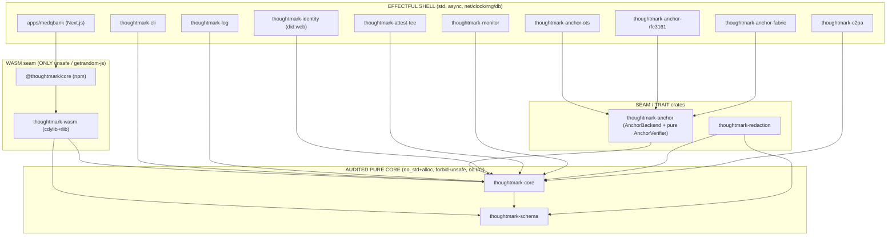

# Code Architecture: the implementation design of `thoughtmark`

> The third planning pillar for **thoughtmark** — the tamper-evident provenance/notarization library for
> multi-turn human–AI reasoning trails specified in [`roadmap.md`](./roadmap.md). Where the roadmap defines
> _what_ to build and [`quality-foundations.md`](./quality-foundations.md) defines the _quality contract_ that
> holds a ~100%-AI-authored codebase at research tier, this document defines **how the code is shaped**: the
> crate/package graph, module paths, the reasoning-trail schema, the internal design of every tier, the
> byte-identical WASM binding, the offline verify pipeline, the frozen public API, and the reference app.
> It is written so that any engineer can build the roadmap flawlessly, and it is internally consistent
> end-to-end: **one name per type, one value per hashed string.**

> **How to read this.** §1–§3 (scope, invariants, topology) are prerequisites for everything else. Crypto/core
> auditors → §2, §4, §6, §7, §10, §11, §14. Binding/TS engineers → §12, §13, §14. Plugin authors → §3, §8, §9,
> §16. Reference-app engineers → §5, §11, §15. Cross-references are **by section number**.

---

## Table of contents

1. Purpose, scope & relationship to `roadmap.md` and `quality-foundations.md`
2. Architectural principles & invariants
3. System topology — the Cargo + pnpm workspace, the crate graph, dependency directions, the directory tree
4. Tier 0 — canonicalization, hashing & content addressing
5. The reasoning-trail data model & schema (the white-space core)
6. Tier 1 — the Merkle transparency log
7. Signing & attestation — DSSE, in-toto, the `thoughtmark` predicate, the proof bundle
8. Tier 2 — anchoring plugin architecture
9. Cross-cutting: identity (DID/VC) & redaction / selective disclosure
10. Determinism runtime & error model
11. The end-to-end verify pipeline
12. WASM/TS binding architecture & the byte-identical guarantee
13. The cross-language conformance harness
14. The frozen public API surface — Rust signatures + TS mirror
15. Reference app (MedQBank) — Next.js / Supabase
16. Versioning & evolution
17. Mapping architecture components to roadmap Phases 0–5
18. Architecture Decision Records (ADR) seeds
19. Architecture-level threat considerations

---

# 1. Purpose, scope & relationship to `roadmap.md` and `quality-foundations.md`

## 1.1 What this document is

This is the **code architecture** for `thoughtmark`: the concrete crate/package graph, module paths,
type/trait/function signatures, wire shapes, and data-flow an engineer with no prior context can build from. It
sits underneath the two planning documents:

| Document                 | Owns                                                                                                                                                                               | Relationship to this doc                                                                                                                                                                                                                                                                                                                                                                                                                                                                |
| ------------------------ | ---------------------------------------------------------------------------------------------------------------------------------------------------------------------------------- | --------------------------------------------------------------------------------------------------------------------------------------------------------------------------------------------------------------------------------------------------------------------------------------------------------------------------------------------------------------------------------------------------------------------------------------------------------------------------------------- |
| `roadmap.md`             | _What_ to build and _why_ — product scope, the Tier 0–3 model, the standardization white-space, the integrity-of-record honesty frame, Phases 0–5.                                 | This doc is the **structural realization** of the roadmap's "layered library, not a blockchain product" decision: it commits the tiers to specific crates, traits, and bytes. It does not restate the roadmap. Phase mapping is §17.                                                                                                                                                                                                                                                    |
| `quality-foundations.md` | The _pre-implementation quality contract_ — the deterministic, machine-checkable gates (CI-authoritative, hooks-advisory) that hold a ~100%-AI-authored codebase at research tier. | This doc **inherits** those gates as architectural constraints: `#![forbid(unsafe_code)]`, `clippy.toml` disallowed-methods, `cargo-deny`/`cargo-vet`, the `spec/vectors/` conformance corpus as the byte-identity oracle, the no-panic lint wall. Where a quality gate dictates a structural choice (the `vectors`-feature CSPRNG split, the wasm-opt pin, the per-crate `forbid-unsafe` override) the choice is made here. Quality Domain 4 (cross-language conformance) maps to §13. |
| **this doc**             | _How_ the code is shaped: workspace, dependency directions, frozen API, verify pipeline, WASM boundary, schema.                                                                    | Single source of truth for module layout and signatures.                                                                                                                                                                                                                                                                                                                                                                                                                                |

> **The honesty frame is inherited verbatim and is load-bearing on the architecture, not just the prose.**
> `thoughtmark` proves **integrity-of-record** — that a record _existed at time T, in a given lineage L,
> unaltered since capture_. It does **not** prove **validity-of-record** (that the content is true/correct) or
> **faithfulness** (that a logged chain-of-thought reflects the model's actual internal computation). This is
> encoded into the **type system**, not bolted on: the verifier returns a `VerificationResult` carrying a
> permanent, machine-readable `NotEstablished { validity_of_record, faithfulness, authorship_truth,
completeness, time_upper_bound_only }` (§11); schema field names are `attested_at` / `attributed_to` /
> `model_self_reported_version` (§5); per-turn endorsement carries an explicit `approval_scope` so the _limit_
> of an approval lives in the hashed bytes (§5). No public verb is named `verify_trail()` or `verify_correct()`;
> the verbs are `verify_inclusion` / `verify_consistency` / `verify_envelope` / `verify_anchor` / `verify`
> (§6, §7, §8, §11), each honest about the narrow fact it establishes.

## 1.2 Scope of the codebase

**In scope (this architecture builds it):**

1. A pure, audited Rust core `thoughtmark-core` — Tier 0 (canonicalization, content-addressed hashing, CIDv1)
   and Tier 1 (RFC 6962 Merkle proof math, DSSE PAE, Ed25519 `verify_strict`) as **pure functions over bytes**,
   plus the wire-schema crate `thoughtmark-schema` (§4, §5, §6, §7).
2. WASM/TS bindings `@thoughtmark/core` that are **byte-identical** to the Rust core for every operation (§12),
   gated by a cross-language conformance harness (§13).
3. Pluggable, side-effecting crates for Tier 1 log operation, Tier 2 anchoring (OpenTimestamps, RFC 3161,
   Fabric), identity (DID/VC), redaction, Tier 3 attestation (TEE/ZKML), and C2PA/CAWG interop — each behind a
   trait defined in/near core, depending **inward only** (§3, §6, §8, §9).
4. A thin Next.js + Supabase reference app on the MedQBank study platform — capture flow, Postgres schema + RLS,
   periodic-root anchoring job, verifier UI, exports (§15).
5. The frozen public API surface and its versioning/evolution rules (§14, §16).

**Out of scope (architecturally acknowledged, deliberately not solved in v1):**

- **Capture-integrity / the oracle problem.** The architecture _moves_ the trust boundary (Tier 3 TEE
  attestation in §9 binds "model M produced output Y on input X") but never claims to eliminate it; the schema
  records `model_self_reported_*` fields honestly.
- **Chain-of-thought faithfulness.** Structurally un-addressable; `NotEstablished.faithfulness` states this in
  every result.
- **Validity/correctness of the reasoning.** Never claimed; there is no code path that asserts it.

---

# 2. Architectural principles & invariants

These are the non-negotiable properties the structure exists to enforce. Each is stated as **the invariant** and
**the concrete enforcement mechanism** (a compile gate or CI gate, never a convention). If a later design choice
violates one of these, the design choice is wrong.

## 2.1 The invariant table

| #      | Invariant                                                                                                                                                                       | Structural enforcement (mechanism, not promise)                                                                                                                                                                                                                                                                                                                                                                                 |
| ------ | ------------------------------------------------------------------------------------------------------------------------------------------------------------------------------- | ------------------------------------------------------------------------------------------------------------------------------------------------------------------------------------------------------------------------------------------------------------------------------------------------------------------------------------------------------------------------------------------------------------------------------- |
| **I1** | **Byte-identical output across Rust core, WASM, and TS.** Identical logical input ⇒ byte-identical canonical bytes / digests / proofs / signatures / PAE on every platform.     | `spec/vectors/` is the oracle (§13). One required CI job runs native Rust **and** the WASM build (Node + 3 headless browser engines) over every vector and asserts byte equality against the committed expected files. The WASM module _is_ the same compiled Rust (§12); the boundary carries only `Uint8Array`/`string`/`bigint`, never structured JS objects, so no JS-side re-encoding can occur.                           |
| **I2** | **Always JCS-canonicalize before hashing.** No bare `H(json)`; every hash is over RFC 8785 bytes with a domain/version prefix (§4.5).                                           | A single choke point `thoughtmark_core::canon::jcs` — an in-house RFC 8785 encoder (the `std`-only `serde_json_canonicalizer` cannot run in the `no_std` wasm core; it + a pure-TS oracle are differential checks only — **ADR-0001 as amended**; **`serde_jcs` still banned**). A clippy `disallowed-methods` lint bans `serde_json::to_vec`/`to_string` on hashed data.                                                       |
| **I3** | **No ambient nondeterminism in core logic.** No `SystemTime::now`, `Instant::now`, `rand::thread_rng`, `rand::random`. Time and RNG are **injected** through explicit APIs.     | `clippy.toml` `disallowed-methods` + `disallowed-types` ban these in `thoughtmark-core`/`-schema` (compile-gate, mirrored in CI). Time enters as `Clock::now() -> UnixMillis`; randomness as `Rng`/`Csprng` traits; signing keys via a `Signer` trait. `verify()` takes no RNG (verification is deterministic) and reads the clock **once** at entry (§10, §11).                                                                |
| **I4** | **No floating point anywhere on the canonicalization / hashing / CID / Merkle path.** (WASM has NaN-bit and signed-zero nondeterminism.)                                        | `f32`/`f64` are in `disallowed-types` for `canon`/`hash`/`cid`/`merkle`. A `validate_no_float(&Value)` walker rejects any JSON `f64` or integer outside the I-JSON safe range **before** canonicalization (§4.3). Decoding params are fixed-point `*_milli: u32`; oversized integers (`UnixMillis`, RNG seeds) are carried as decimal **strings** (§4.3, §5). The TS mirror types `u64` as `bigint`, never `number` (§12, §14). |
| **I5** | **Store only salted hashes; never store sensitive content; never put content on any chain.**                                                                                    | Content is modeled as `ContentDigest::Hashed { alg, digest_hex }` (a salted commitment, salt held **off-ledger**, §4.7/§9) or `ContentDigest::Cid(Cid)` — the on-ledger types **cannot carry a plaintext body** (§5). `AnchorRequest` carries only a 32-byte root digest — structurally incapable of carrying an artifact body (§8). Raw turn bodies live in Supabase Storage under RLS, crypto-shreddable (§9, §15).           |
| **I6** | **Audited crypto crates only; never hand-roll.** Ed25519 via `ed25519-dalek` 2.x with **`verify_strict` always**; hashing via `blake3` + `sha2`.                                | The dependency budget is fixed and enforced by `cargo-deny`. The _only_ sanctioned Ed25519 verification path is `verify_strict` (rejects small-order `A`/`R`, enforces canonical `S`); a clippy lint bans bare `verify`. RFC 6962 proof math is reimplemented in core (it _is_ the spec, must be byte-identical, ~300 LOC) but checked against `transparency-dev/merkle` + `tlog_tiles` as differential oracles (§6, §18).      |
| **I7** | **Integrity-of-record, NOT validity-of-record, NOT faithfulness.**                                                                                                              | Encoded in types (`NotEstablished`, `ApprovalScope`), field names (`attested_at`, `attributed_to`, `model_self_reported_version`), and verb naming. See §1.1, §5, §11.                                                                                                                                                                                                                                                          |
| **I8** | **Pure, layered, dependency-light, audited core.** `thoughtmark-core` is `#![no_std]`+`alloc`, `#![forbid(unsafe_code)]`, no network, no DB, no clock, no chain, no RNG-source. | `[workspace.lints.rust] unsafe_code = "forbid"`; only `thoughtmark-wasm` overrides it. A CI script over `cargo metadata` fails the build if core's dependents include any networking/plugin crate, or if core's own deps include a networking crate, `getrandom`, `wasm-bindgen`, `tokio`, or `reqwest` (§3.3).                                                                                                                 |

## 2.2 Principles that follow from the invariants

**P1 — Determinism is a _compile-time and CI_ property, not a runtime hope.** The bans in I3/I4 are clippy
`disallowed-methods`/`disallowed-types` (advisory hook + authoritative CI, per `quality-foundations.md`). A
`cargo build -p thoughtmark-core --target wasm32-unknown-unknown --no-default-features --features alloc` job
asserts `getrandom` and `wasm-bindgen` are absent from `cargo tree` — feature-unification leakage of
`getrandom/js` or `ed25519-dalek/rand_core` into the audited core would silently re-introduce host
nondeterminism and is the single most insidious failure mode.

**P2 — The pure/sync core ↔ effectful/async shell split is the spine.** Every prior-art system (Sigstore,
Tessera, Atlas — §18) separates _small pure proof-math + canonical data model_ from _large side-effecting
operate-the-log / talk-to-anchors / verify-identity shells_. `thoughtmark` replicates this exactly. This single
diagram is the canonical statement of the boundary; later sections refer back to it rather than redrawing it:

```
            ┌──────────────────────────── PURE CORE (audited, no I/O, no clock, no RNG) ───────────────────────────┐
 bytes ───► │ canon · hash · CID · merkle-verify · checkpoint-verify · DSSE-PAE · ed25519 verify_strict ·          │ ───► bytes / Result / VerificationResult
            │ verify-bundle · redact · export(PROV-O/C2PA, never re-hashed)                                        │
            └───────────────────────────────────────────────────────────────────────────────────────────────────-┘
                     ▲ INJECTED traits:  Clock · Rng/Csprng · Signer · MerkleReader · AnchorVerifier · IdentityResolver
            ┌──────────────────── EFFECTFUL SHELL (std, async, network / clock / RNG / DB) ──────────────────────────┐
            │ thoughtmark-log (sequencer + LogStorage drivers + checkpoint signer) · anchor-* (OTS/RFC3161/Fabric    │
            │ submit/upgrade) · identity-did (did:web) · attest-tee · redaction key store · c2pa · monitor ·         │
            │ thoughtmark-cli · the Next.js/Supabase reference app                                                  │
            └─────────────────────────────────────────────────────────────────────────────────────────────────────┘
```

Anchoring submission, key generation, salt generation, did:web resolution, log sequencing, and persistence are
_all_ in the shell. The core never reads a clock, opens a socket, or calls an RNG.

**P3 — Extension seams are frozen as `#[non_exhaustive]` traits + opaque byte-blob proofs.** Tier 2/3 and
multi-party attach through traits defined now (`Signer`, `MerkleReader`, `AnchorVerifier`, `Anchorer`,
`Attestor`, `IdentityResolver`) and through receipt types whose proof payload is `Vec<u8>` (opaque). The core
never learns a proof's internal structure, so OTS/RFC 3161/Fabric/TEE/ZKML format evolution lands in plugin
crates **without touching core SemVer** (§8, §9, §16). Adding an `AnchorKind`/`AttestationKind`/`HashAlg`/
`ErrorCode`/`Action` variant is a MINOR release because the enums are `#[non_exhaustive]`.

**P4 — Three orthogonal version axes; never conflate them** (full policy §16). (a) **Code SemVer** of the
crates/packages; (b) **corpus SemVer** of `spec/vectors/` (any expected-byte change is a MAJOR corpus release);
(c) **format identifiers** baked _into hashed bytes_ (`canon_version`, the `predicateType` URI, the DSSE
`payloadType`). Changing a hashed byte is simultaneously a new format-identifier _value_ + a MAJOR corpus
release + usually only a MINOR code release (you add `canon_v2`, never mutate `canon_v1`).

**P5 — `canon_version` is bound inside the preimage; verifiers fail closed on the unknown.** Old artifacts stay
verifiable under their original rules forever because the verifier dispatches on the embedded `canon_version`
(`"tm-jcs-1"`, §4.5) and never deletes an old `canon_vN` module. An unknown version is
`ErrorCode::UnknownCanonVersion` (a permanent negative vector) — **never** a best-effort recompute, because
wrong-rules canonicalization could forge a passing verification (§4, §11, §16).

**P6 — Export is one-way and never re-hashed.** PROV-O and C2PA projections are lossy interop _views_ derived
from the native schema; they are explicitly **not** canonicalized and **must not** be fed back into `hash()`.
This isolates C2PA/CAWG/PROV-O spec churn from the byte-format train and avoids RDF-dataset-canonicalization
nondeterminism on the trusted path (§5.10, §9, §14).

**P7 — The schema is conversationally expressive AND deterministic** (per the adversarial schema verdict). The
canonical `Turn` is the **multi-part** one (`content: Vec<ContentPart>`, including a `ToolCall` part with hashed
args/result); edits/regenerations are first-class via a typed `supersedes` edge + lifecycle action verbs kept
distinct from endorsement verbs; ordering authority is the `parents` DAG + Merkle leaf position (with `sequence`
demoted to a non-authoritative display hint); and `tree_size` is bound into the in-toto `subject.name` so a
Statement attests a trail _prefix at size N_, not the evolving whole (§5).

## 2.3 What "audited core" means concretely

The trust boundary is exactly `{ thoughtmark-core, thoughtmark-schema }` — two `#![no_std]`+`alloc` crates.
Everything that does I/O is plain `std`. The audited surface carries:

- `#![forbid(unsafe_code)]` (workspace lint; only `thoughtmark-wasm` overrides).
- `#![deny(clippy::unwrap_used, clippy::expect_used, clippy::panic, clippy::indexing_slicing,
clippy::arithmetic_side_effects, clippy::unreachable, clippy::todo, clippy::float_arithmetic,
clippy::string_slice)]` — the no-panic wall (§10). Every "impossible" case returns
  `Error::Internal(&'static str)` (a static site label, never runtime data) instead of panicking, because a
  Rust panic crossing the WASM boundary becomes an uncatchable `RuntimeError`.
- Zero networking, clock, or RNG-source crates in the dependency tree (CI-asserted via `cargo tree`).

---

# 3. System topology — the Cargo + pnpm workspace, the crate graph, dependency directions, the directory tree

## 3.1 One monorepo, two cooperating package graphs

`thoughtmark` is a **single git repository** containing a **Cargo workspace** (`resolver = "3"`, edition 2024,
Rust 1.96.0) and a **pnpm workspace**, physically interleaved but logically disjoint. They touch at **exactly one
seam**: the `crates/thoughtmark-wasm` cdylib output is consumed by `packages/core`. This mirrors the proven
`c2pa-rs` layout (pure `sdk` core + isolated `c2pa_c_ffi` cdylib + `export_schema` codegen + `make_test_images`
fixtures) and the fine-grained decomposition of `sigstore-rs`.

**Coexistence rules:**

1. **Disjoint member globs.** Cargo `[workspace] members = ["crates/*"]` only (never spanning `apps/`).
   `pnpm-workspace.yaml` lists `packages/*` and `apps/*`. Neither tool sees the other's manifests. `target/` and
   `node_modules/` are git-ignored; `.gitattributes` marks `*.wasm binary`.
2. **The wasm build is a Cargo step invoked by an npm script, not a Cargo dependency of TS.**
   `packages/core/package.json` runs `wasm-pack build ../../crates/thoughtmark-wasm --target web …`; generated
   `.js`/`.wasm`/`.d.ts` land in `packages/core/wasm/` (git-ignored, rebuilt in CI). **One artifact only** —
   `--target web` — which also runs under Node ≥20 via the facade's loader (§12.2). No `--target nodejs` build.
3. **`just` is the single build-graph oracle.** `just ci` runs the Cargo jobs and the pnpm jobs in the correct
   order (wasm built before TS conformance). No Turborepo in v1 (ADR-0003).

> **Keep `fuzz/` OUTSIDE the workspace.** `cargo-fuzz` pins a dated nightly; making `fuzz/` a workspace member
> would drag the whole workspace off the 1.96.0 stable pin. `fuzz/` is a standalone Cargo project
> (`publish = false`), run in a dedicated nightly CI job (ADR-0006).

## 3.2 The directory tree

```text
thoughtmark/
├── Cargo.toml                      # [workspace] resolver="3"; [workspace.package|dependencies|lints]
├── Cargo.lock                      # committed (reproducible builds)
├── rust-toolchain.toml             # channel="1.96.0", edition 2024, components rustfmt/clippy/rust-src/llvm-tools-preview
├── clippy.toml                     # disallowed-methods: SystemTime::now, Instant::now, thread_rng, random, serde_json::to_vec
│                                   # disallowed-types:   SystemTime, f32, f64 (scoped to canon/hash/cid/merkle)
├── deny.toml  rustfmt.toml  taplo.toml  typos.toml
├── package.json                    # root: { "private": true, "packageManager": "pnpm@9.x" }
├── pnpm-workspace.yaml             # packages: ["packages/*", "apps/*"]
├── justfile                        # `just ci` == the whole CI graph (Rust + TS, in order)
├── biome.json  tsconfig.base.json  lefthook.yml
│
├── crates/                         # ── Cargo workspace members ───────────────────────────────────
│   ├── thoughtmark-core/           # THE pure audited primitive. no_std+alloc. forbid(unsafe). Tier 0 + Tier 1 math.
│   │   └── src/
│   │       ├── lib.rs              # #![no_std] #![forbid(unsafe_code)] #![deny(missing_docs)] + no-panic lints
│   │       ├── determinism/        # Clock, Rng, Csprng traits + UnixMillis; FixedClock/SeededRng (vectors feature)
│   │       ├── error.rs            # Error (#[non_exhaustive], thiserror) + ErrorCode (stable, content-free)
│   │       ├── canon/              # jcs.rs nofloat.rs digest.rs cid.rs domain.rs salt.rs error.rs  (Tier 0 — §4)
│   │       ├── merkle/             # rfc6962.rs tree.rs inclusion.rs consistency.rs tiles.rs  (Tier 1 math — §6)
│   │       ├── checkpoint.rs       # C2SP signed-note checkpoint build/verify  (§6)
│   │       ├── dsse.rs             # PAE + Envelope + ed25519 verify_strict  (§7)
│   │       ├── sign.rs             # Signer trait, TmSigner (keygen behind `keygen` feature)  (§7)
│   │       ├── did_key.rs          # PURE did:key decode (offline)  (§9)
│   │       ├── anchor.rs           # AnchorVerifier/AnchorReceipt/AnchorVerdict SEAM + opaque proof bytes (§8)
│   │       ├── bundle.rs           # ThoughtmarkBundle (self-verifying offline container)  (§7, §11)
│   │       └── verify/             # verify() orchestrator + VerificationResult + NotEstablished  (§11)
│   ├── thoughtmark-schema/         # serde wire structs: Trail/Turn/ContentPart/ContributionLedger/RunManifest
│   │                               #   + in-toto Statement/Subject + thoughtmark predicate. no_std+alloc. (§5)
│   ├── thoughtmark-wasm/           # cdylib+rlib wasm-bindgen shim. ONLY crate allowed unsafe / getrandom-js. (§12)
│   ├── thoughtmark-cli/            # `tm` reference/debug CLI (std): verify bundles, print/bless vectors.
│   ├── thoughtmark-schemagen/      # build-only: schemars JSON Schema + TS types from -schema. Not published.
│   ├── thoughtmark-testkit/        # dev-only: loads spec/vectors, drives core. Not published. (§13)
│   ├── thoughtmark-log/            # SHELL (std): LogStorage trait + InMemory/Postgres/Tile drivers, sequencer,
│   │                               #   checkpoint signing. Pure proof math is in core::merkle. (§6)
│   ├── thoughtmark-anchor/         # SEAM crate: async AnchorBackend + the PURE AnchorVerifier impl (DER/CMS/OTS
│   │                               #   parsers live HERE, not in core), AnchorScheduler. (§8)
│   ├── thoughtmark-anchor-ots/     # OpenTimestamps calendar protocol (net). Tier-2 plugin. (§8)
│   ├── thoughtmark-anchor-rfc3161/ # RFC 3161 TSA client via x509-tsp + tsp-asn1 (net). Tier-2 plugin. (§8)
│   ├── thoughtmark-anchor-fabric/  # Hyperledger Fabric anchor (net). Tier-2 plugin (deferred, Phase 4). (§8)
│   ├── thoughtmark-identity/       # SEAM crate: IdentityResolver; did:web (net) + VC 2.0 verify. (§9)
│   ├── thoughtmark-redaction/      # salted-hash field redaction, redactable-Merkle prune, crypto-shred. (§9)
│   ├── thoughtmark-attest-tee/     # Attestor impl: NVIDIA NRAS / Phala (net). Tier-3 plugin (deferred). (§9)
│   ├── thoughtmark-monitor/        # consistency-proof monitor + identity scanner (split-view defense). (§18, §19)
│   └── thoughtmark-c2pa/           # C2PA v2.3+ text-manifest / CAWG export adapter. interop plugin (Phase 5). (§9)
│
├── packages/                       # ── pnpm workspace members (TS/WASM) ──────────────────────────
│   ├── core/                       # @thoughtmark/core — wraps wasm-pack output + hand-written TS facade + .d.ts
│   │   └── { package.json, src/{index,node,browser}.ts, wasm/ (generated, gitignored), tests/conformance.test.ts }
│   ├── vectors/                    # @thoughtmark/vectors — the spec/vectors corpus published for TS consumers (§16)
│   └── verifier-ui/                # @thoughtmark/verifier-ui — shared React verifier components (optional)
│
├── apps/
│   └── medqbank/                   # Next.js (App Router, Node runtime) + Supabase reference app. (§15)
│                                   #   depends on @thoughtmark/core "workspace:*"
│
├── spec/                           # ── language-neutral, THE ORACLE ──────────────────────────────
│   ├── SPEC.md                     # BCP-14 normative, stable req IDs (CANON-3, LOG-7, SIG-2 …)
│   ├── canon/CANON.md  predicates/provenance-v1.md
│   └── vectors/                    # VERSION, CHANGELOG.md (append-only); manifest.json + per-op cases (§13)
│       └── { canon/ hash/ cid/ ed25519/ dsse/ merkle/ consistency/ checkpoint/ redact/ verify/ negative/ }
│
├── fuzz/                           # cargo-fuzz targets — SEPARATE Cargo.toml, NOT a workspace member; pins nightly
│   └── fuzz_targets/{ jcs, cid, merkle_verify, consistency_verify, dsse_parse, did_key }.rs
│
└── docs/                           # adr/ (MADR), threat-model.md, mdBook
```

## 3.3 The crate graph and dependency directions

The single most important structural rule (**I8**): **dependency arrows point INWARD to core; no plugin is ever
a dependency of core.**



Notes that make the graph correct:

- **`thoughtmark-core` depends on nothing in-workspace except `thoughtmark-schema`.** It never depends on
  `-log`, `-anchor*`, `-identity`, `-attest*`, `-redaction`, `-monitor`, `-wasm`, or any networking crate.
- The async `AnchorBackend` (submit/upgrade) and the **pure** `AnchorVerifier` impl both live in
  `thoughtmark-anchor` — so DER/CMS/OTS-parse deps stay out of the audited core. Core defines only the
  `AnchorVerifier` _trait_ + the opaque `AnchorReceipt`/`AnchorVerdict` types; `verify()` (§11) takes an injected
  `&dyn AnchorVerifier` (ADR-0008).
- **Plugins pin a compatible _range_ of core** (`thoughtmark-core = ">=1, <2"`), never `"=1.2.3"`, so a plugin
  can ship a MAJOR without forcing a core MAJOR (§16).

**The dependency-direction invariant is CI-enforced.** A script over `cargo metadata` fails the build if (a)
`thoughtmark-core`'s reverse-dependency list contains any `*-anchor-*`/`*-identity*`/`*-attest*`/`*-c2pa`/
`*-log`/`*-redaction`/`wasm` crate, or (b) `thoughtmark-core`'s own dependency closure contains any networking
crate, `getrandom`, `wasm-bindgen`, `tokio`, or `reqwest`.

## 3.4 The `std` / `no_std`+`alloc` boundary

| Crate                                                                                                                                         | Build mode                                                                                            | Why                                                                                                                                                                                                                                |
| --------------------------------------------------------------------------------------------------------------------------------------------- | ----------------------------------------------------------------------------------------------------- | ---------------------------------------------------------------------------------------------------------------------------------------------------------------------------------------------------------------------------------- |
| `thoughtmark-core`, `thoughtmark-schema`                                                                                                      | `#![no_std]` + `extern crate alloc;` (`std` feature default-on for native, **off** for the wasm path) | Needs `Vec`/`String`/`BTreeMap` for canonical bytes and proofs, but must link cleanly into `wasm32-unknown-unknown` without OS facilities. `serde_json` pulls the `alloc` requirement — hence `no_std + alloc`, not bare `no_std`. |
| `thoughtmark-wasm`                                                                                                                            | `cdylib` + `rlib`, target `wasm32-unknown-unknown`                                                    | The one quarantine for `unsafe` and JS-RNG. `rlib` so native differential tests (§13.4) can link it.                                                                                                                               |
| everything else (`-cli`, `-log`, all `-anchor-*`, `-identity`, `-redaction`, `-attest-*`, `-monitor`, `-c2pa`, `-schemagen`, `-testkit`, app) | plain `std`                                                                                           | They do I/O.                                                                                                                                                                                                                       |

The `no_std` island is **exactly** `{ core, schema }` — precisely the audited, byte-identical surface.

## 3.5 Feature-flag strategy (default-light; tiers are crates, not features)

The roadmap's "no feature soup" lesson is honored by making **tiers separate crates, not features of core**:

- `thoughtmark-core` default features = `["std"]` only. The wasm path builds `--no-default-features --features
alloc`. There is no tier code in core, so there are no tier features to gate there — avoiding cross-workspace
  feature-unification surprises entirely.
- **`keygen`** feature on core (off by default) gates the one RNG-injecting helper
  (`generate_signer<R: CryptoRng>`), so the audited _verify_ path never links a CSPRNG (§7, §10).
- **`vectors`** feature on core (off by default) gates `FixedClock`, `SeededRng`, and the test-only
  `VectorCsprng` newtype that `impl Csprng` — so **production can never reproduce a real salt/key from a test
  seed** (§10, §13).
- **`json_schema`** feature on `thoughtmark-schema` (off by default; only `-schemagen` enables it) gates the
  `schemars` derives, so production builds and the wasm bundle never carry `schemars`.
- Each anchoring/identity/TEE plugin carries its own `rustls` (default) / `native-tls` feature for its HTTP
  client.
- **No umbrella `thoughtmark` meta-crate in v1** (ADR-0004): consumers add the explicit plugin crate they want,
  keeping the graph legible for `cargo-deny`/`cargo-vet` and preventing feature-unification leakage into the
  `no_std` core. CI runs `cargo hack --feature-powerset` to prove all combinations build.

## 3.6 Key manifest shapes (the load-bearing bits)

**Workspace root `Cargo.toml`:**

```toml
[workspace]
resolver = "3"
members  = ["crates/*"]                  # crates/ ONLY — never spans apps/

[workspace.package]
version      = "0.1.0"
edition      = "2024"
rust-version = "1.96.0"
license      = "Apache-2.0"

[workspace.dependencies]
thoughtmark-core         = { path = "crates/thoughtmark-core",   version = "0.1.0" }
thoughtmark-schema       = { path = "crates/thoughtmark-schema", version = "0.1.0" }
serde_json_canonicalizer = "0.3"                                  # RFC 8785 JCS (serde_jcs is BANNED — ADR-0001)
serde_json               = { version = "1", features = ["arbitrary_precision"] }  # large ints survive parse (§4.3)
blake3                   = { version = "1.8",  default-features = false }
sha2                     = { version = "0.11", default-features = false }
ed25519-dalek            = { version = "2.2",  default-features = false, features = ["alloc"] }  # NO rand_core in core
cid                      = { version = "0.11", default-features = false, features = ["alloc"] }
multihash                = { version = "0.19", default-features = false }
subtle                   = { version = "2",    default-features = false }
thiserror                = { version = "2",    default-features = false }

[workspace.lints.rust]
unsafe_code = "forbid"                    # per-crate override allows it ONLY in thoughtmark-wasm

[profile.release]
trim-paths = "all"                        # RFC 3127 reproducible paths (stable since 1.81; do NOT hand-roll --remap-path-prefix)
strip      = true
lto        = "thin"
```

**`thoughtmark-core/src/lib.rs` preamble:**

```rust
#![no_std]
#![forbid(unsafe_code)]
#![deny(missing_docs)]
#![deny(clippy::unwrap_used, clippy::expect_used, clippy::panic,
        clippy::indexing_slicing, clippy::arithmetic_side_effects,
        clippy::unreachable, clippy::todo, clippy::float_arithmetic, clippy::string_slice)]
extern crate alloc;
#[cfg(feature = "std")] extern crate std;
```

**`thoughtmark-wasm/Cargo.toml` — the unsafe / JS-RNG quarantine (the _only_ override):**

```toml
[lib]
crate-type = ["cdylib", "rlib"]           # cdylib for the npm artifact; rlib so §13.4 native differential tests link it

[lints.rust]                               # do NOT set `lints.workspace = true` here — that would re-forbid unsafe
unsafe_code = "allow"                      # wasm-bindgen emits unsafe; confine it here (+ #![deny(unsafe_op_in_unsafe_fn)])

[dependencies]
thoughtmark-core   = { workspace = true, default-features = false }   # alloc-only, NOT std
thoughtmark-schema = { workspace = true, default-features = false }
wasm-bindgen       = "=0.2.125"           # EXACT pin; CLI version MUST equal crate version (must match spec/vectors/manifest.json)

[target.'cfg(target_arch = "wasm32")'.dependencies]
getrandom = { version = "0.3", features = ["js"] }   # blast radius CONFINED HERE, never in core
```

> The per-crate lint override is the **only** place `forbid(unsafe_code)` is relaxed. Every other crate inherits
> `lints.workspace = true`. The reproducible-`.wasm` build (pinned/disabled `wasm-opt`, `SOURCE_DATE_EPOCH`, the
> committed `.wasm` BLAKE3 assertion) is specified once in **§12.5** — do not duplicate it here.

`packages/core/package.json` (the seam between the two graphs) is specified in **§12.2** (a single `--target web`
build; no `--target nodejs`).

## 3.7 Topology decisions resolved (firm recommendations → ADRs in §18)

| Decision                                                        | Recommendation                                                                                                                                                    | One-line rationale                                                                                                                                                                            |
| --------------------------------------------------------------- | ----------------------------------------------------------------------------------------------------------------------------------------------------------------- | --------------------------------------------------------------------------------------------------------------------------------------------------------------------------------------------- |
| One core crate vs `-canon`/`-crypto`/`-merkle` split            | **One `thoughtmark-core` + separate `thoughtmark-schema`**                                                                                                        | A single core is easier to audit as one trusted unit; modules separate cleanly so a later split is mechanical (ADR-0002).                                                                     |
| Tier-1 Merkle: depend on `rs-merkle`/`ct-merkle` vs reimplement | **Reimplement RFC 6962 inside core**; use `ct-merkle` + `transparency-dev/merkle` + `tlog_tiles` only as **differential oracles**                                 | The algorithm _is_ the spec, must be byte-identical in WASM, and an external dep risks domain-separation/leaf-encoding mismatch + breaches `forbid(unsafe)` / offline-determinism (ADR-0005). |
| Stateful log location                                           | **`thoughtmark-log` shell crate** holds storage/sequencing/checkpoint-signing; pure proof math + checkpoint body/verify stay in `core::merkle`/`core::checkpoint` | Keeps DB/clock/RNG out of the audited core while reusing one set of pure hash functions.                                                                                                      |
| Anchor receipt verification location                            | **`thoughtmark-anchor`** (pure `AnchorVerifier` impl), injected into `core::verify`                                                                               | Keeps DER/CMS/OTS/Bitcoin parsers out of the audited core (ADR-0008) while keeping `verify()` offline.                                                                                        |
| Polyglot build orchestration                                    | **`just` + pnpm scripts only in v1**                                                                                                                              | `just ci` already orders Cargo→wasm→TS-conformance; Turborepo adds misconfigurable surface (ADR-0003).                                                                                        |
| Umbrella meta-crate                                             | **None in v1; explicit per-plugin deps**                                                                                                                          | Keeps the graph legible for `cargo-deny`/`cargo-vet`; prevents feature-unification leakage into `no_std` core (ADR-0004).                                                                     |
| `fuzz/` in the workspace                                        | **Outside the workspace**                                                                                                                                         | `cargo-fuzz` pins nightly; would drag the workspace off the 1.96.0 stable pin (ADR-0006).                                                                                                     |

---

# 4. Tier 0 — Canonicalization, Hashing & Content Addressing

Tier 0 is the deterministic byte foundation that every higher tier hashes, Merkle-izes, signs, and anchors. Its
single contract: **identical logical input MUST yield byte-identical canonical output in Rust core, WASM, and
TS** (I1). The `spec/vectors/` corpus (§13) is the oracle. Everything here lives in `thoughtmark-core` and is
pure — bytes in, bytes/`Result` out, no clock, no RNG, no network.

## 4.1 Module layout

```text
crates/thoughtmark-core/src/canon/
  mod.rs        // Tier-0 public surface (re-exports)
  jcs.rs        // RFC 8785 canonicalization (the choke point)
  nofloat.rs    // validate_no_float walker
  digest.rs     // Digest, HashAlg, hash / hash_with / hash_domain  (+ custom Digest serde)
  cid.rs        // CIDv1 for binary blobs
  domain.rs     // CANON_VERSION + domain-separation prefixes
  salt.rs       // Salt + salted_content_digest (the content-commitment helper)
  error.rs      // CanonError (thiserror, no_std via core::fmt)
```

Dependency budget (all `default-features = false`, all audited): `serde`, `serde_json` (with
`arbitrary_precision`), `serde_json_canonicalizer`, `blake3`, `sha2`, `digest`, `cid`, `multihash`, `hex`,
`data-encoding`. **No float, no time, no RNG, no network.**

## 4.2 JCS canonicalization (`canon/jcs.rs`)

We canonicalize **in-house** in `canon::jcs` (an `alloc` RFC 8785 encoder over `serde_json::Value`): the
maintained `serde_json_canonicalizer` crate is `std`-only and cannot compile in the `no_std`+`alloc` wasm core, so
it (and an independent pure-TS oracle) serve as **differential oracles only** — the same pattern as ADR-0005 for
RFC 6962 (**ADR-0001, as amended**; the abandoned `serde_jcs` is still banned). The four RFC 8785 behaviors we
depend on and pin in vectors:

- **Key sort** = UTF-16 code units compared as unsigned `u16` — **not** Rust `char`/UTF-8 byte order and **not**
  Unicode code point. Astral-plane keys (U+10000+) diverge because a surrogate pair (0xD800..) sorts _before_ a
  BMP char like U+E000 under UTF-16 but _after_ under code-point order. We sort keys ourselves by their UTF-16
  code units (`encode_utf16`), and pin a **discriminating** astral-plane vector (`canon/0004`: `U+FFFF` vs
  `U+1F600` — the only class where UTF-16 disagrees with code-point/UTF-8 order; a `😀`-vs-ASCII case does not
  discriminate), plus a differential check against an independent JCS oracle (§13.3) guarding specifically against
  a sort divergence (the exact failure mode that killed `serde_jcs`).
- **Numbers** = ECMAScript `Number.prototype.toString`. We never exercise this branch on hashed data (§4.3).
- **Strings** = minimal escaping per RFC 8785 §3.2.2.2; all other chars, including non-ASCII, emitted raw UTF-8.
- **I-JSON** = no duplicate keys, UTF-8, no insignificant whitespace.

```rust
/// Canonicalize any Serialize value to RFC 8785 bytes. THE choke point —
/// nothing else in the workspace calls serde_json_canonicalizer directly.
pub fn canonicalize<T: Serialize>(value: &T) -> Result<Vec<u8>, CanonError>;
/// Canonicalize an already-parsed Value.
pub fn canonicalize_value(v: &serde_json::Value) -> Result<Vec<u8>, CanonError>;
/// Parse-and-canonicalize untrusted JSON text (the WASM/TS boundary, and verifiers receiving stored JSON).
/// arbitrary_precision is ON so large integers survive the parse; then validate_no_float runs.
pub fn canonicalize_str(json: &str) -> Result<Vec<u8>, CanonError>;
```

> Route 100% of hashed serialization through these and ban direct `serde_json::to_vec` on hashed data via clippy
> `disallowed-methods`: `serde_json`'s default float/whitespace output does not match JCS, so a single stray
> `to_vec` silently breaks byte-identity. The TS facade **must never** `JSON.stringify`/`Number.toString`/sort
> keys itself; it passes raw UTF-8 bytes into the WASM `canonicalize_str`, so the _same Rust code path_ produces
> the bytes on both sides (§12). Re-canonicalizing in JS is the canonical way to break this tier.

## 4.3 The no-float rule (`canon/nofloat.rs`)

Floats are banned in any data that is hashed/CID'd/Merkle-ized (I4): WASM `f64` carries NaN-payload-bit and
signed-zero nondeterminism, and a future canonicalizer swap reintroduces float-formatting risk — so we remove
the entire class structurally rather than trusting a number formatter to be deterministic.

```rust
/// Reject any Number that is an f64, or an integer outside the I-JSON safe range
/// [-(2^53-1), 2^53-1]. Run BEFORE canonicalize on all hashed data.
pub fn validate_no_float(v: &serde_json::Value) -> Result<(), CanonError>;
```

Consequences encoded into the schema (§5): decimals (probabilities, scores, sampling temperature) are carried as
**scaled integers** (per-mille `u32`, e.g. `temperature_milli`); values that may exceed 2⁵³ (epoch-millis, RNG
seeds) are carried as **decimal strings** so JS `BigInt` round-trips them and JCS never emits a number JS cannot
represent. `serde_json`'s `arbitrary_precision` is ON so a large integer from stored JSON is not silently coerced
to `f64` _before_ `validate_no_float` can reject it.

## 4.4 The `Digest` abstraction (`canon/digest.rs`)

```rust
#[derive(Clone, Copy, PartialEq, Eq, Debug)] #[non_exhaustive]
pub enum HashAlg { Blake3, Sha256 }

impl HashAlg {
    /// Multihash code (multiformats table): blake3 = 0x1e, sha2-256 = 0x12.
    pub const fn multihash_code(self) -> u64 { match self { Self::Blake3 => 0x1e, Self::Sha256 => 0x12 } }
    pub const fn digest_len(self) -> usize { 32 }
    /// THE wire token — used in domain prefixes, in-toto subject.digest keys, and the TS union.
    /// One token per alg, everywhere: "blake3" | "sha256".  (NOT the multihash name "sha2-256".)
    pub const fn as_str(self) -> &'static str { match self { Self::Blake3 => "blake3", Self::Sha256 => "sha256" } }
}

/// 32-byte content digest tagged with its algorithm. Copy, no alloc, no_std.
#[derive(Clone, Copy, PartialEq, Eq)]
pub struct Digest { pub alg: HashAlg, pub bytes: [u8; 32] }

impl Digest {
    pub fn to_hex(&self) -> String;            // lowercase hex (in-toto convention)
    pub fn multihash_bytes(&self) -> Vec<u8>;  // <code varint><len=32><32 bytes>
}
```

> **`Digest` has an explicit, hand-written `Serialize`/`Deserialize`** (NOT the derive) emitting exactly
> `{"alg":"blake3","bytes_hex":"<64 lowercase hex>"}`. This is load-bearing: a derived serde would emit
> `bytes` as a JSON array of 32 numbers (which also reopens the no-array-of-ints concern) and the wire form
> would not be the hex string every example and vector assumes. Deserialization is fail-closed: unknown `alg`
> token → `ErrorCode::UnknownHashAlg`; `bytes_hex` length ≠ 64 → `ErrorCode::CanonInvalidJson`.

```rust
pub fn hash_with(alg: HashAlg, bytes: &[u8]) -> Digest;     // hash already-prepared (domain-prefixed) bytes
pub fn hash(bytes: &[u8]) -> Digest;                        // = hash_with(HashAlg::Blake3, bytes)
```

**BLAKE3 (0x1e) is the internal content-addressing default; SHA-256 (0x12) is offered for interop.** The alg is
carried _in_ the `Digest` **and** bound into the hash preimage (§4.5), so a BLAKE3 and a SHA-256 hash of the same
content occupy disjoint domains and cannot be cross-replayed. `#[non_exhaustive]` keeps adding an alg a MINOR
(§16). **Note the Tier-1 separation (§6):** the _transparency-log tree_ is pinned to **SHA-256** (RFC 6962 /
C2SP tlog-tiles / witness interop) and uses a distinct `TreeHash([u8;32])` newtype with the RFC 6962 0x00/0x01
prefixes — it does **not** use this `Digest`/`hash_domain` machinery. Content addressing (this section) and the
log tree (§6) are two explicitly separated hash domains; both columns appear in every relevant vector.

## 4.5 Domain separation + `canon_version` binding (`canon/domain.rs`)

**No content hash is ever a bare `H(canonical_json)`.** Every content/object hash is `H(prefix ||
canonical_json)` where `prefix` is fixed-length ASCII pinning protocol, canon version, algorithm, and object
kind. This defeats (a) cross-protocol replay and (b) silent canon upgrades colliding with old hashes.

```rust
/// THE format identifier, bound INTO every preimage. One value everywhere (ADR-0001).
pub const CANON_VERSION: &str = "tm-jcs-1";

pub mod domain {
    pub const OBJECT:   &str = "thoughtmark.object";    // a Trail / ScholarlyObject (-> trail_root)
    pub const TURN:     &str = "thoughtmark.turn";      // a Turn (-> TurnId)
    pub const MANIFEST: &str = "thoughtmark.manifest";  // a RunManifest (-> its Digest)
}

/// Build the prefix. Itself canonical & versioned:
///   CANON_VERSION ":" alg.as_str() ":" domain ":"
///   e.g. b"tm-jcs-1:blake3:thoughtmark.turn:"
pub fn prefix(alg: HashAlg, domain: &str) -> Vec<u8>;

/// THE core primitive: domain-separated, version-bound content hash.
pub fn hash_domain(alg: HashAlg, domain: &str, canonical_json: &[u8]) -> Digest;
```

There are exactly **three** content-hash domains (`OBJECT`, `TURN`, `MANIFEST`) — the only three structured-JSON
objects that get a self-identifying id. Everything else that is "a hash of some content" (turn content parts,
tool args/results, a free-text note, a system-prompt) is a **salted content digest** of _raw bytes_ (§4.7), not
a domain-prefixed JCS hash; and the **log leaf/node** hashes are RFC 6962 (§6), not these domains. (The
transparency tree's leaf/node domain separation is the RFC 6962 `0x00`/`0x01` byte prefix — see §6 — kept
deliberately distinct from this ASCII-string scheme so the log stays wire-compatible with C2SP/CT tooling.)

`CANON_VERSION` is bound _inside_ the hashed bytes (the cryptographic truth) **and** redundantly carried as a
typed `CanonVersion` field on `Trail`/`Turn`/`RunManifest` that is asserted-equal during validation (the
self-describing convenience). An unknown `canon_version` **fails closed** (`ErrorCode::UnknownCanonVersion`,
§10/§16); a verifier never best-effort canonicalizes under guessed rules.

## 4.6 CIDv1 for binary blobs (`canon/cid.rs`)

Binary blobs (PDFs, images, audio, model-weight references) are **never inlined** into canonical JSON. They are
hashed to a CIDv1 and the CID _string_ appears in the JSON. This keeps canonical JSON small, off the
encoding-ambiguity path, dedup-able, and crypto-shreddable (§9).

```rust
use cid::Cid;  use multihash::Multihash;
pub const RAW_CODEC: u64 = 0x55; // opaque bytes

/// CID of an opaque binary blob. Multihash over the RAW digest bytes (blobs are raw, NOT JCS/domain-prefixed);
/// codec = raw (0x55).
pub fn cid_blob(alg: HashAlg, blob: &[u8]) -> Result<Cid, CanonError>;

/// Canonical text form: CIDv1 base32-lower (multibase 'b'). PIN the base; never rely on Cid::to_string()'s default.
pub fn cid_to_string(c: &Cid) -> String;
```

Decisions: build via `Multihash::wrap(code, digest_bytes)` with hard-coded codec constants (not the
`multihash-codetable` `Code` enum) for a light dep and full control; **pin BLAKE3 multihash length to 32 and
reject any parsed CID whose BLAKE3 multihash length ≠ 32** (multihash 0x1e is variable-length — two CIDs for the
same content could otherwise differ); raw codec `0x55`; base32-lower (multibase `b`). `digest.rs`'s
`multihash_bytes()` and `cid.rs` use the **same** length-32 encoding (a cross-module invariant covered by a CID
vector).

## 4.7 Salted content commitments (`canon/salt.rs`) — and why the salt lives off-ledger

Sensitive content (turn text, tool args/results, a free-text note, a system prompt) is **never stored**; only a
**salted commitment** to it appears on the ledger. This is the foundation of redaction and crypto-shredding (§9).

```rust
/// 32-byte salt supplied by the caller's INJECTED RNG. Core never calls rand (I3).
pub struct Salt(pub [u8; 32]);

/// The content commitment that goes into a ContentDigest::Hashed / args_digest / note_digest, etc.
///   digest = hash_with(alg, salt.0 || content)         // raw bytes; NOT JCS, NOT domain-prefixed
/// The salt is NOT part of this digest's serialization and NEVER enters the canonical Turn / signed Statement.
pub fn salted_content_digest(alg: HashAlg, salt: &Salt, content: &[u8]) -> Digest;
```

> **The salt is external by construction.** The on-ledger commitment is the 32-byte `digest`; the `(salt,
content)` pair lives off-ledger (Supabase Storage / a deletable key store, §9, §15). To _prove_ a disclosed
> value matches, a holder presents `salt` + `content` and the verifier recomputes the digest. To _erase_ it
> (GDPR Art. 17 / medical confidentiality), the shell deletes the salt (and/or the ciphertext) — the commitment,
> and every Merkle/anchor proof built over the Statement that contains it, stay byte-for-byte valid. This is why
> **`ContentDigest::Hashed` carries `digest_hex` only, never `salt_hex`** (§5.6): a salt committed inside the
> signed/logged bytes could never be deleted, and crypto-shredding-by-salt-deletion would be impossible. Core
> never generates salts (I3); the shell injects them.

## 4.8 Tier-0 data flow

```text
        raw blob ──► cid_blob ──► "bafy…"  (CID string, embedded in JSON)
   content bytes ──► salted_content_digest(alg, salt, ·) ──► Digest  (the ContentDigest::Hashed commitment; salt kept off-ledger)
     Turn struct ──► validate_no_float ──► canonicalize (JCS) ──► canon bytes ──► hash_domain(alg, TURN, ·) = TurnId
    Trail struct ──► validate_no_float ──► canonicalize (JCS) ──► canon bytes ──► hash_domain(alg, OBJECT, ·) = trail_root
```

## 4.9 Tier-0 error model (`canon/error.rs`)

`CanonError` is `thiserror`-derived, `no_std` via `core::fmt`, and carries **no content** in messages (§10):
`InvalidJson`, `FloatNotAllowed`, `IntegerOutOfRange`, `DuplicateKey`, `Multihash`, `Cid`, `UnknownHashAlg`,
`UnknownCanonVersion`. It maps into the crate-wide `Error`/`ErrorCode` (§10) via the mapping table in §10.2; the
WASM layer renders that to a structured `{code,message}` JS error (§12.6).

---

# 5. The Reasoning-Trail Data Model & Schema (the white-space core)

This is the standardization white-space: a content-addressed, append-only **DAG of attributed reasoning turns**,
with attribution carried in an OmniScientist-OSP-derived **ContributionLedger**, an AI **RunManifest** bound per
turn, a lossy one-way **PROV-O** projection, and an honesty frame encoded _in the field names and the type
system_. It wraps as the `predicate` of an in-toto Statement (§7) and its DSSE envelope is the Tier-1 log leaf
(§6). All types live in `thoughtmark-schema` (`#![no_std]`+`alloc`).

> **The adversarial schema verdict is honored verbatim (P7):** (1) a typed `supersedes` edge + lifecycle vs
> endorsement action split; (2) multi-part content with a first-class `ToolCall` part; (3) `parents` +
> Merkle-leaf position as the **sole** ordering authority with `sequence` demoted to a display hint;
> (4) `tree_size` bound into the in-toto `subject.name`; (5) `approval_scope` placed _in the hashed bytes_.

## 5.1 Shared scalar types (the determinism-critical wire forms)

```rust
/// Schema version. Serializes as an OBJECT {"major":1,"minor":0,"patch":0} via an explicit serde impl
/// (a tuple struct would serialize as the array [1,0,0]).
pub struct SchemaVersion { pub major: u16, pub minor: u16, pub patch: u16 }

/// Injected logical time, integer Unix milliseconds. Custom Serialize/Deserialize AS A DECIMAL STRING
/// ("1750000000000") — NOT a JSON number — so values may exceed 2^53 without violating I4 / I-JSON. (§10.1)
pub struct UnixMillis(pub i64);

/// canon_version as a typed value; serializes as its as_str() ("tm-jcs-1"); parse() is fail-closed (§16).
#[non_exhaustive] pub enum CanonVersion { TmJcs1 }

/// Float-free JSON value for the `extensions` escape hatch — no f64 variant, so JCS stays deterministic.
pub enum CanonicalValue { Null, Bool(bool), Int(i64), Str(String), Arr(Vec<CanonicalValue>),
                          Obj(BTreeMap<String, CanonicalValue>) }
```

Every wire struct below is `#[serde(deny_unknown_fields)]` (fail-closed parsing + byte-identity on
re-serialization) and uses `#[serde(skip_serializing_if = "Option::is_none")]` so an absent field is distinct
from `null` and from `[]`.

## 5.2 Participant & identity

```rust
#[derive(Serialize, Deserialize)] #[serde(rename_all = "snake_case")]
pub enum ParticipantKind { Human, Ai }

#[derive(Serialize, Deserialize)] #[serde(deny_unknown_fields)]
pub struct Participant {
    pub kind: ParticipantKind,
    pub id: String,                                  // did:key (offline) or did:web (institutional). NEVER PII.
    /// kind=ai only. The model SELF-REPORTED identity; the field name encodes "reported, not third-party-attested" (§9).
    #[serde(skip_serializing_if = "Option::is_none")] pub model_self_reported_version: Option<String>,
    #[serde(skip_serializing_if = "Option::is_none")] pub role: Option<String>,   // "investigator", "assistant", …
    /// Optional VC binding (W3C VCDM 2.0) BY DIGEST — the full VC is held off-ledger, crypto-shreddable (§9).
    #[serde(skip_serializing_if = "Option::is_none")] pub vc_ref: Option<Digest>,
}

/// A reference to the credited participant inside a ledger entry.
pub struct ParticipantRef { pub id: String }        // a DID verificationMethod URL; becomes the DSSE keyid (§7)
```

Both humans and AI are co-equal OSP Participants keyed by **DID**; `id` is a verificationMethod-resolvable DID
URL. Identity resolution (did:key pure/offline; did:web injected) is §9 — the schema only binds the opaque
references into the hash.

## 5.3 Actions — lifecycle vs endorsement (verdict resolution #1)

```rust
#[derive(Serialize, Deserialize)] #[serde(rename_all = "snake_case")] #[non_exhaustive]
pub enum Action {
    // ── lifecycle verbs (how the artifact came to be) ──
    Create, Refine, Propose, Edit, Regenerate, Retract,
    // ── endorsement verbs (a stance ON an artifact, NOT a correctness claim) ──
    Review, Approve, Reject,
}
```

`#[non_exhaustive]` makes new verbs a MINOR (§16). The lifecycle/endorsement split makes edit-and-regenerate —
the single most common real multi-turn pattern — first-class (paired with the typed `supersedes` edge, §5.8)
while keeping endorsement honestly scoped. `Review`/`Reject` semantics are deliberately under-specified in v1.

## 5.4 Approval scope — the honesty limit _in the bytes_ (verdict resolution #5)

```rust
#[derive(Serialize, Deserialize)] #[serde(rename_all = "snake_case")] #[non_exhaustive]
pub enum ApprovalScope { Reviewed, Endorsed, Acknowledged, NoClaim }
```

`Endorsed` reads strongly but is recorded in the hashed `LedgerEntry`, so the _limit_ of an approval is
cryptographically committed — a consumer can no longer infer "human verified correctness" from a bare
`[ai create, human approve]` sequence. This mirrors the `NotEstablished` discipline of the verify pipeline (§11)
and closes the integrity-vs-validity honesty hole at the schema layer.

## 5.5 ContributionLedger

```rust
#[derive(Serialize, Deserialize)] #[serde(deny_unknown_fields)]
pub struct LedgerEntry {
    pub action: Action,
    pub attributed_to: ParticipantRef,               // the credited participant (DID) — "attributed", not "author"
    pub attested_at: UnixMillis,                      // INJECTED time — "attested", not "occurred"
    #[serde(skip_serializing_if = "Option::is_none")] pub approval_scope: Option<ApprovalScope>,  // for endorsement verbs
    #[serde(skip_serializing_if = "Option::is_none")] pub note_digest: Option<Digest>,            // salted hash of a free-text note
}
#[derive(Serialize, Deserialize)] pub struct ContributionLedger { pub entries: Vec<LedgerEntry> }
```

A single `Turn` carries **≥1** entries; multiple entries give sub-turn multi-party attribution (human `create` →
AI `refine` → human `approve`). The ledger is the heart of the predicate; PROV-O is _derived_ from it (§5.10),
never stored separately, so there is one source of truth that gets canonicalized and hashed.

## 5.6 Content parts (verdict resolution #2)

```rust
#[derive(Serialize, Deserialize)] #[serde(tag = "kind", rename_all = "snake_case")] #[non_exhaustive]
pub enum ContentPart {
    /// Text/image/audio/pdf content referenced by salted-hash commitment or CID.
    Content { media_type: String, body: ContentDigest },              // "text/plain", "image/png", "application/pdf"
    /// A specific tool INVOCATION with hashed args/result/error (the agentic near-future).
    ToolCall {
        tool: ToolRef,                                                // { name, version, digest? }
        args_digest: Digest,                                          // salted commitment to args (no content)
        #[serde(skip_serializing_if = "Option::is_none")] result_digest: Option<Digest>,
        #[serde(skip_serializing_if = "Option::is_none")] error: Option<Digest>,
    },
}

#[derive(Serialize, Deserialize)] #[serde(tag = "kind", rename_all = "snake_case")] #[non_exhaustive]
pub enum ContentDigest {
    /// Salted commitment to text content. digest_hex = salted_content_digest(alg, salt, bytes) (§4.7).
    /// NOTE: NO salt_hex here — the salt lives off-ledger so the content is crypto-shreddable (§4.7, §9).
    Hashed { alg: HashAlg, digest_hex: String },
    /// CIDv1 (raw codec) for binary/multimodal blobs (§4.6).
    Cid { cid: String },
}

#[derive(Serialize, Deserialize)] #[serde(deny_unknown_fields)]
pub struct ToolRef {
    pub name: String, pub version: String,
    #[serde(skip_serializing_if = "Option::is_none")] pub digest: Option<Digest>,  // optional hash of the tool binary/spec
}
```

This makes "text + 2 images + a tool result" a normal `Vec<ContentPart>`, and per-invocation tool provenance
representable with hashed args/result — no abuse of `extensions{}`.

## 5.7 The AI RunManifest (bound per turn)

```rust
#[derive(Serialize, Deserialize)] #[serde(deny_unknown_fields)]
pub struct RunManifest {
    pub canon_version: CanonVersion,
    pub provider: String,                            // "anthropic"
    pub model_id: String,                            // "claude-opus-4-8"
    pub model_self_reported_version: String,         // vendor-reported; name encodes provenance
    pub decoding: DecodingParams,
    pub system_prompt_digest: Digest,                // salted commitment — proves WHICH system prompt without storing it
    #[serde(skip_serializing_if = "Vec::is_empty", default)] pub tools: Vec<ToolRef>,   // tools AVAILABLE (vs ToolCall = invoked)
    #[serde(skip_serializing_if = "Option::is_none")]        pub context_window: Option<u32>,
    #[serde(skip_serializing_if = "Option::is_none")]        pub seed: Option<String>,           // decimal STRING (may exceed 2^53)
    #[serde(skip_serializing_if = "Option::is_none")]        pub inference_attestation: Option<AttestationRef>,  // Tier-3, empty until Phase 4
    #[serde(skip_serializing_if = "BTreeMap::is_empty", default)] pub provider_params: BTreeMap<String, CanonicalValue>,
}
#[derive(Serialize, Deserialize)] #[serde(deny_unknown_fields)]
pub struct DecodingParams {
    pub temperature_milli: u32,                      // round(temp * 1000); NEVER f64 (I4)
    pub top_p_milli: u32,
    #[serde(skip_serializing_if = "Option::is_none")] pub max_output_tokens: Option<u32>,
}
#[derive(Serialize, Deserialize)] #[serde(deny_unknown_fields)]
pub struct AttestationRef { pub tee: String, pub evidence_cid: String }   // "tdx" | "sev-snp" | "nras" | "ezkl"
```

The manifest's own id is `hash_domain(alg, domain::MANIFEST, canonicalize(rm))` (its dedicated domain — §4.5),
referenced from the turn via `run_manifest_ref`, so model identity is cryptographically attached to every AI
turn (Atlas-style). `temperature`/`top_p` as fixed-point `*_milli u32` is the single most important defense
against a byte-identity break in this domain. Every field is `model_self_reported` in spirit — the naming makes
that explicit so no consumer reads it as third-party-attested.

## 5.8 Turn & Trail (verdict resolutions #3, #4)

```rust
pub struct TurnId(pub Digest);                       // derived id; serializes as the tagged Digest object. NOT stored inside Turn.

#[derive(Serialize, Deserialize)] #[serde(rename_all = "snake_case")]
pub enum TurnRole { Human, Ai, System, Tool }

#[derive(Serialize, Deserialize)] #[serde(deny_unknown_fields)]
pub struct Turn {
    pub schema_version: SchemaVersion,
    pub canon_version: CanonVersion,                 // == CANON_VERSION; asserted-equal (fail-closed)
    pub sequence: u64,                               // NON-authoritative display hint ONLY (see below)
    pub role: TurnRole,
    pub content: Vec<ContentPart>,                   // verdict #2: MULTI-PART
    pub parents: Vec<TurnId>,                        // DAG edges (linear chat = single parent); SOLE topological authority
    #[serde(skip_serializing_if = "Option::is_none")] pub supersedes: Option<TurnId>,        // verdict #1: typed edit/regenerate/retract edge
    pub ledger: ContributionLedger,
    #[serde(skip_serializing_if = "Option::is_none")] pub run_manifest_ref: Option<Digest>,  // AI/System/Tool turns MUST set this (validated)
    #[serde(skip_serializing_if = "BTreeMap::is_empty", default)] pub extensions: BTreeMap<String, CanonicalValue>,
}

#[derive(Serialize, Deserialize)] #[serde(deny_unknown_fields)]
pub struct Trail {                                   // a.k.a. ScholarlyObject
    pub schema_version: SchemaVersion,
    pub canon_version: CanonVersion,
    pub trail_id: String,                            // opaque caller-supplied id
    pub created_attested_at: UnixMillis,
    pub turns: Vec<TurnId>,                          // canonical (display) order; authority is the DAG + leaf position
    pub head: TurnId,
    #[serde(skip_serializing_if = "BTreeMap::is_empty", default)] pub extensions: BTreeMap<String, CanonicalValue>,
}
```

**Ordering authority is normative (SPEC.md `LOG-*`):** `parents` (the DAG) plus the Merkle-log leaf position are
the _sole_ ordering authority. `sequence` is a per-branch display hint a verifier never relies on — a true
branch can produce a `sequence` that contradicts the topology, so two implementations must not be allowed to
derive different orders from it. Derivations (pure, in core/schema):

```rust
pub fn turn_id(t: &Turn)    -> Result<TurnId, SchemaError>;            // hash_domain(alg, domain::TURN, canon(t))
pub fn trail_root(t: &Trail) -> Result<BTreeMap<String, String>, SchemaError>;  // {"blake3":hex, "sha256":hex}
```

A `TurnId` _is_ its turn's content digest, so any mutation changes the id — tamper-evidence is intrinsic, and a
`TurnId` is never a field inside `Turn` (you cannot hash a struct containing its own hash).

## 5.9 in-toto Statement wrapping (detail in §7)

```rust
#[derive(Serialize, Deserialize)]
pub struct Statement {
    #[serde(rename = "_type")]         pub type_: String,            // "https://in-toto.io/Statement/v1"
    pub subject: Vec<ResourceDescriptor>,
    #[serde(rename = "predicateType")] pub predicate_type: String,   // "https://thoughtmark.dev/Provenance/v1"
    pub predicate: Trail,                                            // the Trail IS the predicate
}
#[derive(Serialize, Deserialize)]
pub struct ResourceDescriptor {
    pub name: String,                                                // binds tree_size: "trail:<trail_id>@<tree_size>" (verdict #4)
    pub digest: BTreeMap<String, String>,                           // {"blake3":hex, "sha256":hex} (dual, for SHA-256-only verifiers)
}
```

`tree_size` is bound into `subject.name` (`trail:<id>@<N>`); each Statement attests a **prefix at size N**, not
the evolving trail. Every appended turn changes `trail_root`, so "the Statement for this trail" is otherwise
ambiguous; the prefix framing is honest and lets verifiers chain consistency proofs (§6) across snapshots.

## 5.10 PROV-O export (lossy, one-way, off the hashed path — P6)

```rust
pub fn export_prov(trail: &Trail, turns: &[Turn], manifests: &[RunManifest]) -> serde_json::Value;
```

Mapping: `Turn`/blob → `prov:Entity`; `Action`/`LedgerEntry` → `prov:Activity` (typed by the verb);
`Participant` → `prov:Agent` (AI subtyped `tm:AIAgent`). Relations: entity `prov:wasGeneratedBy` its
create-Activity; `prov:wasAttributedTo` its `attributed_to`; child turn `prov:wasDerivedFrom` each parent (and
`supersedes` → `tm:supersedes`); an AI Activity `prov:used` its `RunManifest` Entity. **PROV-O is derived on
demand and NEVER hashed** (JSON-LD requires RDF Dataset Canonicalization, a different and divergence-prone
algorithm than JCS; hashing it would forfeit byte-identity). The native schema is the sole oracle.

## 5.11 Worked example — a serialized trail

A two-turn MedQBank micro-session: a human asks a question (turn 0); the AI proposes an explanation with one
image and one tool call (turn 1); the human then endorses it (a second ledger entry on turn 1). Hashes/CIDs are
truncated for readability. Note every `Digest` is the tagged object `{"alg":…,"bytes_hex":…}`, every time is a
decimal string, `canon_version` is `"tm-jcs-1"`, and no `salt_hex` appears anywhere.

**Turn 0** → `turn_id = hash_domain(blake3, "thoughtmark.turn", canon(turn0))`:

```json
{
  "schema_version": { "major": 1, "minor": 0, "patch": 0 },
  "canon_version": "tm-jcs-1",
  "sequence": 0,
  "role": "human",
  "content": [
    {
      "kind": "content",
      "media_type": "text/plain",
      "body": {
        "kind": "hashed",
        "alg": "blake3",
        "digest_hex": "blake3-of-{salt||question}…"
      }
    }
  ],
  "parents": [],
  "ledger": {
    "entries": [
      {
        "action": "create",
        "attributed_to": { "id": "did:key:z6MkInvestigator…" },
        "attested_at": "1750000000000"
      }
    ]
  }
}
```

**RunManifest** → `digest = hash_domain(blake3, "thoughtmark.manifest", canon(rm))`:

```json
{
  "canon_version": "tm-jcs-1",
  "provider": "anthropic",
  "model_id": "claude-opus-4-8",
  "model_self_reported_version": "claude-opus-4-8-20260601",
  "decoding": {
    "temperature_milli": 200,
    "top_p_milli": 950,
    "max_output_tokens": 1024
  },
  "system_prompt_digest": {
    "alg": "blake3",
    "bytes_hex": "blake3-of-{salt||sysprompt}…"
  },
  "tools": [{ "name": "pubmed_search", "version": "2.1.0" }],
  "context_window": 200000,
  "seed": "184467440737095516"
}
```

**Turn 1** — multi-part content, a tool call, two ledger entries (AI propose + human endorse with explicit
`approval_scope`), bound to the manifest:

```json
{
  "schema_version": { "major": 1, "minor": 0, "patch": 0 },
  "canon_version": "tm-jcs-1",
  "sequence": 1,
  "role": "ai",
  "content": [
    {
      "kind": "content",
      "media_type": "text/markdown",
      "body": {
        "kind": "hashed",
        "alg": "blake3",
        "digest_hex": "blake3-of-{salt||explanation}…"
      }
    },
    {
      "kind": "content",
      "media_type": "image/png",
      "body": { "kind": "cid", "cid": "bafkreigh2akiscaildc…" }
    },
    {
      "kind": "tool_call",
      "tool": { "name": "pubmed_search", "version": "2.1.0" },
      "args_digest": {
        "alg": "blake3",
        "bytes_hex": "blake3-of-{salt||args}…"
      },
      "result_digest": {
        "alg": "blake3",
        "bytes_hex": "blake3-of-{salt||result}…"
      }
    }
  ],
  "parents": [{ "alg": "blake3", "bytes_hex": "blake3-of-turn-0…" }],
  "run_manifest_ref": { "alg": "blake3", "bytes_hex": "blake3-of-rm…" },
  "ledger": {
    "entries": [
      {
        "action": "propose",
        "attributed_to": { "id": "did:web:models.example:agents:claude" },
        "attested_at": "1750000005000"
      },
      {
        "action": "approve",
        "attributed_to": { "id": "did:key:z6MkInvestigator…" },
        "approval_scope": "endorsed",
        "attested_at": "1750000060000"
      }
    ]
  }
}
```

**in-toto Statement** wrapping the trail at `tree_size = 2`, with `tree_size` bound into `subject.name` and dual
digests:

```json
{
  "_type": "https://in-toto.io/Statement/v1",
  "subject": [
    {
      "name": "trail:7f3c1e2a-session@2",
      "digest": {
        "blake3": "blake3-trail-root…",
        "sha256": "sha256-trail-root…"
      }
    }
  ],
  "predicateType": "https://thoughtmark.dev/Provenance/v1",
  "predicate": { "...": "the Trail object above" }
}
```

This Statement is JCS-canonicalized, DSSE-wrapped (PAE, §7), Ed25519-signed with the proposing agent's DID key
(`keyid = did:web:models.example:agents:claude#key-1`), appended as a Tier-1 leaf (§6), and — periodically — its
root anchored (§8). The verifier (§11) reports exactly: _existed at/before T, this human/AI lineage, unaltered
since capture_ — and explicitly **not** that the explanation is correct or the answer right.

## 5.12 Determinism contract & invariants checklist

| Rule                         | Mechanism                                                                                                    |
| ---------------------------- | ------------------------------------------------------------------------------------------------------------ |
| Byte-identical Rust/WASM/TS  | all serialization through `canonicalize` (§4.2); WASM never re-canonicalizes (§12)                           |
| No floats on the hashed path | `validate_no_float` + `*_milli` ints + decimal-string `UnixMillis`/seeds (§4.3, §5.1)                        |
| Large ints survive parse     | `serde_json` `arbitrary_precision`; >2⁵³ carried as strings (§4.3)                                           |
| Closed shape                 | `#[serde(deny_unknown_fields)]` on all wire types; absent ≠ `null` via `skip_serializing_if`                 |
| Extensible without breakage  | typed float-free `extensions: BTreeMap<String, CanonicalValue>` (§16)                                        |
| Deterministic maps           | `BTreeMap` everywhere; JCS re-sorts keys (UTF-16)                                                            |
| Self-identifying ids         | `TurnId = hash_domain(TURN, ·)`; never stored inside `Turn`                                                  |
| Single ordering authority    | `parents` DAG + Merkle-leaf position; `sequence` is a display hint only                                      |
| Honesty in the bytes         | `attested_at`/`attributed_to`/`model_self_reported_version`; `ApprovalScope`; lifecycle vs endorsement verbs |
| No content, ever             | salted `ContentDigest::Hashed`/CID only (salt off-ledger); enables crypto-shredding (§9)                     |
| Prefix-bound canon_version   | `hash_domain` prefix + redundant typed field, asserted-equal; unknown → fail closed                          |

`proptest` invariants to ship (§13): `canonicalize` is idempotent; `turn_id` is stable under JCS key
re-sorting; mutating any turn byte changes `trail_root`; `export_prov` is a pure function of `(trail, turns,
manifests)`; `validate_no_float` rejects every `vectors/negative/` float/`>2⁵³` case identically in Rust and
WASM.

---

# 6. Tier 1 — the Merkle transparency log

Tier 1 is an RFC 6962 / RFC 9162 binary Merkle tree whose leaves are the JCS-canonical DSSE envelopes of §7. The
**entire proof-construction-and-verification math** lives in pure `thoughtmark-core::merkle` (no I/O, no clock,
no RNG) so it is trivially WASM byte-identical and offline-verifiable; the **mutable, stateful log** (sequencing,
persistence, checkpoint signing) lives in the `thoughtmark-log` shell crate behind a `LogStorage` trait. This is
the Sigstore/Trillian-Tessera split (§18) realized as a crate boundary.

## 6.1 The transparency tree is SHA-256, not BLAKE3 — and a distinct hash type

The transparency tree is pinned to **SHA-256** for RFC 6962 / C2SP tlog-tiles / witness / monitor interop, even
though BLAKE3 is the Tier-0 content-addressing default (§4.4). To make the two impossible to confuse at the type
level, the tree uses a dedicated newtype, **not** the content `Digest`:

```rust
// thoughtmark-core::merkle::rfc6962
pub struct TreeHash(pub [u8; 32]);                       // ALWAYS SHA-256; carries no alg tag
pub const LEAF_PREFIX: u8 = 0x00;
pub const NODE_PREFIX: u8 = 0x01;

/// The ONLY place the 0x00/0x01 RFC 6962 domain prefixes appear.
pub fn hash_leaf(leaf_bytes: &[u8]) -> TreeHash;          // SHA-256(0x00 || leaf_bytes)
pub fn hash_children(l: &TreeHash, r: &TreeHash) -> TreeHash;  // SHA-256(0x01 || l || r)
pub fn empty_root() -> TreeHash;                          // SHA-256("")
```

The leaf bytes fed to `hash_leaf` are the JCS-canonical DSSE envelope (§7); since `canon_version` is bound inside
those bytes, a canonicalization change forces a new leaf hash rather than a silent collision. The RFC 6962
`0x00`/`0x01` byte prefixes are the _only_ domain separation for the tree — the ASCII-string `hash_domain` scheme
of §4.5 is content-addressing and never touches the tree (this reconciles the two leaf/node domains the spec
must never conflate).

## 6.2 The pure tree and the two verifiers (the integrity heart)

```rust
// merkle/tree.rs — MTH(D[n]) with the largest-power-of-two split; iterative to bound WASM stack.
pub fn merkle_tree_hash(leaves: &[TreeHash]) -> TreeHash;
//   let k = largest power of two STRICTLY less than n  (k = 1 << (usize::BITS-1 - (n-1).leading_zeros()) for n>1)

pub struct TreeState { pub size: u64, pub root: TreeHash }   // a checkpoint commitment (no clock)

pub struct InclusionProof  { pub leaf_index: u64, pub tree_size: u64, pub path: Vec<TreeHash>, pub leaf: TreeHash }
pub struct ConsistencyProof { pub first: u64, pub second: u64, pub path: Vec<TreeHash> }

/// RFC 9162 §2.1.3.1 iterative verifier — constant stack, explicit path-length checks (closes a forgery vector
/// where an attacker pads the proof). Pure, offline, deterministic; this is THE thing WASM/TS must match.
pub fn verify_inclusion(p: &InclusionProof, root: &TreeHash) -> Result<(), Error>;
/// RFC 9162 §2.1.4.2 dual-recompute: derive BOTH old and new roots from the path and compare both.
pub fn verify_consistency(p: &ConsistencyProof, old: &TreeHash, new: &TreeHash) -> Result<(), Error>;
```

Both verifiers take `&TreeHash`, never `&[u8]`, so "forgot to domain-hash" is a type error; they never panic and
never allocate unboundedly (the no-panic wall, §10). Hash equality uses `subtle::ConstantTimeEq`. The RFC 9162
_iterative_ forms are used in preference to the recursive RFC 6962 forms specifically because recursion blows the
WASM stack on large trees.

> **Pitfalls pinned by vectors (§13):** the largest-power-of-two split must be _strictly less than_ `n` (a naive
> `n/2` is wrong and passes only on powers of two); the `0x00`/`0x01` prefixes must be applied identically in
> Rust and WASM; the path-length check must reject both too-long and too-short proofs.

## 6.3 Proof _construction_ — pure math, injected node source

Construction needs the tree (or tiles), so the node _source_ is injected via a `MerkleReader`/`HashReader`
trait, but the math is the same pure routine used for the in-memory driver and for generating vectors:

```rust
pub struct NodeId { pub level: u8, pub index: u64 }
pub trait MerkleReader { fn read_nodes(&self, ids: &[NodeId]) -> Result<Vec<TreeHash>, Error>; }

pub fn inclusion_proof(prev: &TreeState, leaf_index: u64, reader: &dyn MerkleReader) -> Result<InclusionProof, Error>;
pub fn consistency_proof(first: u64, second: u64, reader: &dyn MerkleReader) -> Result<ConsistencyProof, Error>;
pub fn append(prev: &TreeState, leaf: &[u8]) -> Result<TreeState, Error>;   // recompute-only; SHA-256 fixed (no alg param)
```

> `append` is **recompute-only**: it computes the new `TreeState` from the prior state plus the new leaf; it does
> **not** persist anything (storage and gap-free index assignment are the shell's job, §6.5). The tree alg is
> fixed SHA-256, so `append`/`inclusion_proof`/`consistency_proof`/`verify_*` take **no `HashAlg` parameter**.

## 6.4 Checkpoints / Signed Tree Heads (C2SP signed-note — `core::checkpoint`)

The signed tree head is a **C2SP signed-checkpoint / signed-note**, byte-compatible with Go sumdb / Sigstore /
CT witnesses, so independent witnesses can cosign by appending signature lines and off-the-shelf monitors can
verify it. Body lines are `\n`-separated; the body ends with `\n`; then a blank line; then signature lines:

```text
thoughtmark.dev/log/medqbank-2026        <- origin (schemeless URL, no spaces)
2                                         <- tree size (ASCII decimal, no leading zeros)
<base64(root TreeHash)>                   <- base64(SHA-256 root at that size)
                                          <- blank line
— <keyname> <base64(4-byte keyhash || 64-byte ed25519 sig)>   <- signature line(s); line starts with em-dash U+2014 + space
```

```rust
pub struct Checkpoint { pub origin: String, pub size: u64, pub root: TreeHash, pub extensions: Vec<String> }
pub fn checkpoint_body(c: &Checkpoint) -> Vec<u8>;                         // deterministic body bytes (no signer)
pub fn sign_checkpoint(body: &[u8], signer: &dyn Signer) -> Vec<u8>;       // appends a signed-note line (injected key)
pub fn verify_checkpoint(note: &[u8], keyname: &str, vk: &VerifyingKey) -> Result<Checkpoint, Error>;
```

Key hash = `SHA-256(keyname || 0x0A || 0x01 || pubkey32)[..4]` (algorithm byte `0x01` = Ed25519). The signed
bytes are the body up to and including the trailing newline. Two exactness traps the vectors pin: the line prefix
is **em-dash + space** (`— `, U+2014 0x20), not a hyphen; and `verify_checkpoint` must assert **at least one**
signature line actually matched (the note spec mandates ignoring unknown signatures, so a "verified" checkpoint
could otherwise carry zero valid ones).

## 6.5 The stateful log — `thoughtmark-log` (shell) and the `LogStorage` seam

```rust
// thoughtmark-log::storage  (std; never imported by thoughtmark-core)
pub trait LogStorage: Send + Sync {
    fn append(&self, leaf_bytes: &[u8], leaf_hash: &TreeHash) -> Result<u64, StorageError>; // returns gap-free index
    fn tree_size(&self) -> Result<u64, StorageError>;
    fn read_nodes(&self, ids: &[NodeId]) -> Result<Vec<TreeHash>, StorageError>;            // materialized perfect-subtree hashes
    fn read_leaf(&self, index: u64) -> Result<Vec<u8>, StorageError>;
    fn root_at(&self, size: u64) -> Result<TreeHash, StorageError>;
    fn put_checkpoint(&self, size: u64, note: &[u8]) -> Result<(), StorageError>;
    fn latest_checkpoint(&self) -> Result<Option<Vec<u8>>, StorageError>;
}
```

Three drivers, all delegating hashing to `thoughtmark-core` so roots/proofs are identical:

- **`InMemoryStorage`** — `Vec`-backed; used by the vectors corpus and conformance tests.
- **`PostgresStorage`** — the single-institution Supabase deployment (DDL in §15.4). The sequencer serializes
  writes with `pg_advisory_xact_lock(hashtext(log_id::text))` to guarantee **gap-free, monotonically increasing
  indices** (a hard requirement — a gap or duplicate silently corrupts every later root). **Do not** run
  Trillian/Tessera for a single tenant (Go microservices, MySQL/Spanner, gRPC — operationally unjustified);
  embed the pure tree over Postgres and expose a tiles _export_ for external monitors.
- **`TileStorage`** — the public shared log: serve the exact C2SP `tlog-tiles` layout (tiles
  `<prefix>/tile/<L>/<N>[.p/<W>]`, height-8 / 256-hash / 8192-byte full tiles, entry bundles with big-endian
  `uint16` length-prefixed entries, `/checkpoint`) from object storage (Supabase Storage / S3 / CDN). The
  index encoding is the unusual `x`-prefixed 3-digit-group form (`1234067 → x001/x234/067`); `core::merkle::tiles`
  parses tiles + an entry bundle and a `HashReader` so a thin verifier fetches only the O(log n) tiles needed and
  verifies **offline**.

## 6.6 Per-turn leaves, witnesses, monitors

Each **turn's** DSSE-wrapped Statement is a separate leaf (fine-grained per-turn attribution + selective
disclosure: a single turn can be redacted/crypto-shredded without invalidating others, §9). A trail is
identified by `subject.name`; periodic checkpoints anchor batches of turns (§8).

- **Witness** (`thoughtmark-monitor` / a `thoughtmark-witness` reference): given a new checkpoint and a
  consistency proof from the last checkpoint it cosigned, verifies append-only-ness via `verify_consistency`
  (pure core) and appends its own C2SP cosignature line. A verifier `Policy` (§11) can require _k-of-n_ witness
  cosignatures before trusting integrated time — the practical defense against a log operator presenting a
  **split view** (inclusion proofs alone cannot detect a fork).
- **Monitor**: fetches entry bundles / checkpoints, verifies a consistency proof old→new each interval (pure
  core), and alarms on failure; also scans for a watched participant DID. This is the operational meaning of
  "tamper-evident, not tamper-proof." The Tier-2 anchor of the periodic root (§8) is the complementary,
  no-cooperation-required defense.

## 6.7 Data flow

```text
WRITE (shell):  build Statement → JCS → DSSE-sign (PAE, §7) → canonical envelope bytes
                → leaf_hash = core::hash_leaf(envelope)  → LogStorage::append (gap-free index, update merkle_nodes)
                → periodically (injected clock): root_at(size) → checkpoint_body → sign_checkpoint → put_checkpoint
                → Tier-2 anchors ONLY this periodic root (§8)
VERIFY (pure/offline, core): get DSSE leaf + InclusionProof + signed checkpoint
                → verify_checkpoint (Ed25519, + optional witness cosignatures)
                → leaf_hash = hash_leaf(JCS(envelope)); verify_inclusion(proof, &checkpoint.root)
                → optional verify_consistency(old_ckpt, new_ckpt). No socket/DB/clock once bytes are in hand.
```

---

# 7. Signing & attestation — DSSE, in-toto, the `thoughtmark` predicate, the proof bundle

Signing is a pure, deterministic envelope wrapping every sealed turn's provenance record as a **DSSE**-signed
**in-toto Statement v1** whose `predicate` is the §5 `Trail`, signed with **Ed25519** (`ed25519-dalek` 2.x,
**always `verify_strict`**). All primitives are pure over already-canonical bytes and already-constructed keys —
no clock, no RNG (Ed25519 signing is deterministic per RFC 8032), no network. Modules: `core::dsse`,
`core::sign`, `core::bundle`, `core::did_key`.

## 7.1 DSSE PAE — exact construction (the byte-identity load-bearing detail)

```text
PAE(type, body) = "DSSEv1" SP LEN(type) SP type SP LEN(body) SP body
```

`SP` is a single ASCII space `0x20`; `LEN(s)` is the ASCII-decimal byte-length with **no leading zeros**; `type`
is the UTF-8 of `payloadType`; `body` is the **raw JCS-canonical Statement bytes** (NOT base64). For thoughtmark,
`payloadType = "application/vnd.in-toto+json"`.

```rust
pub const DSSE_PAYLOAD_TYPE: &str = "application/vnd.in-toto+json";
pub fn pae(payload_type: &str, body: &[u8]) -> Vec<u8>;   // build LEN via itoa (allocation-free, locale-free) — NOT format!
```

The PAE bytes — not the JSON envelope — are what gets signed and what the vectors corpus pins. The WASM/TS side
builds the identical sequence (JS `String(n)` yields no leading zeros for non-negative integers, matching).
Common bug to avoid: signing the base64 payload string or the whole envelope instead of `PAE(type, raw canonical
Statement)`.

## 7.2 The envelope and the in-toto Statement

```rust
#[derive(Serialize, Deserialize)]
pub struct DsseEnvelope {
    pub payload: String,                              // base64(STD, padded) of canonical Statement bytes
    #[serde(rename = "payloadType")] pub payload_type: String,   // "application/vnd.in-toto+json"
    pub signatures: Vec<EnvSig>,                      // thoughtmark seals EXACTLY ONE per turn (ADR-0007)
}
#[derive(Serialize, Deserialize)]
pub struct EnvSig { pub keyid: String, pub sig: String }   // keyid = DID verificationMethod URL; sig = base64(STD) of 64-byte sig
```

Encoding rule for byte-identity: **emit STANDARD padded base64 on write** (one canonical envelope), but
`verify_envelope` **accepts both** standard and url-safe on read (DSSE spec allows either). The signature is over
PAE bytes, which are independent of the base64 choice — that is the cross-language oracle. The in-toto Statement
(`Statement` in §5.9) is `_type = "https://in-toto.io/Statement/v1"`, `predicateType =
"https://thoughtmark.dev/Provenance/v1"`, `subject[].digest` a `{blake3, sha256}` lowercase-hex map (matched
purely by digest, so a SHA-256-only verifier interoperates), `predicate` = the `Trail`.

## 7.3 Ed25519 — `ed25519-dalek` 2.x, `verify_strict` ALWAYS (I6)

`verify_strict` is mandatory (a clippy `disallowed-methods` lint bans bare `verify`): Curve25519's cofactor 8
means plain `verify()` admits small-order/torsion components in `A` and `R`, yielding malleable / non-canonical
signatures — two valid signatures for one `(key, message)` — which corrupts Merkle-leaf stability and
consistency proofs. `verify_strict` rejects small-order `A`/`R` and enforces canonical `S` via the cofactorless
equation `[S]B = R + [k]A'`. The exact accept/reject boundary for edge cases is pinned by importing **Wycheproof**

- **ed25519-speccheck** vectors (and the `ed25519-dalek` version is pinned in `spec/vectors/manifest.json`).

## 7.4 Key types & hygiene (`secrecy` 0.10 + `zeroize` + `subtle`)

```rust
use secrecy::{SecretBox, ExposeSecret};
pub struct VerifyingKey(ed25519_dalek::VerifyingKey);     // public, Serialize, Debug-safe
pub struct Signature(pub [u8; 64]);
pub struct KeyId(String);                                 // a DID verificationMethod URL (with #fragment)

/// Private signer. 32-byte seed held in a SecretBox, zeroized on drop; never Debug/Display/Serialize/Clone.
pub struct TmSigner { inner: SecretBox<[u8; 32]>, public: VerifyingKey, key_id: KeyId }
impl TmSigner {
    pub fn from_seed(seed: [u8; 32]) -> Result<Self, Error>;        // NO RNG; did:key keyid derived from public key
    pub fn verifying_key(&self) -> &VerifyingKey;
    pub fn key_id(&self) -> &KeyId;
    pub fn sign_statement(&self, statement_canon: &[u8]) -> DsseEnvelope;   // PAE then Ed25519, one EnvSig
}

/// The Signer SEAM used by the log/anchor/checkpoint code so key material never enters those layers.
pub trait Signer { fn key_id(&self) -> &str; fn sign(&self, msg: &[u8]) -> Signature; }

/// keygen is the ONLY place RNG enters; gated so the audited verify path never links a CSPRNG.
#[cfg(feature = "keygen")]
pub fn generate_signer<R: rand_core::CryptoRng + rand_core::RngCore>(rng: &mut R) -> TmSigner;

pub fn verify(vk: &VerifyingKey, pae_bytes: &[u8], sig: &Signature) -> Result<(), Error>;   // verify_strict
pub fn verify_envelope(env: &DsseEnvelope, keys: &[VerifyingKey]) -> Result<Statement, Error>;
```

`secrecy` 0.10 is `SecretBox<T>` (the old `Secret<T>` is renamed); the seed never derives `Debug`/`Serialize`/
`Clone`; intermediates are wrapped in `Zeroizing`; any secret-adjacent comparison uses `subtle::ConstantTimeEq`,
never `==`.

## 7.5 DID naming of the signing key

The DSSE `keyid` is the full DID verificationMethod URL (`did:…#key-1`) so a verifier resolves to a specific key
(rotation-friendly):

- **did:key** (offline, self-sovereign): `did:key:z<base58btc(0xed 0x01 || pubkey32)>`; the verificationMethod id
  is the controller DID with the multibase string repeated as the fragment. `core::did_key` derives/validates
  this with **no network** (pure, byte-identical) and rejects any non-Ed25519 multicodec or off-curve key.
- **did:web** (institutional, rotatable): resolution (HTTPS) lives in `thoughtmark-identity` (§9); core only
  validates that a _supplied_ DID document's verificationMethod bytes equal the `VerifyingKey`.

## 7.6 The offline verification bundle — `ThoughtmarkBundle`

The single self-describing artifact (Sigstore-bundle lineage) that lets a verifier check everything **without**
contacting a calendar/log/DID host. This is the **one** bundle definition (§11 consumes it; §14 freezes it):

```rust
#[derive(Serialize, Deserialize)] #[serde(deny_unknown_fields)]
pub struct ThoughtmarkBundle {
    pub media_type: String,                  // "application/vnd.thoughtmark.bundle.v1+json" (versioned, mirrors Sigstore)
    pub bundle_version: u16,                  // gates schema; BundleVersionUnsupported otherwise
    pub canon_version: CanonVersion,          // must equal the predicate's; UnknownCanonVersion otherwise
    pub envelope: DsseEnvelope,               // DSSE-wrapped in-toto Statement — the Trail (with its ContributionLedger) is INSIDE the signed payload
    pub verification_material: VerificationMaterial,   // keys / stapled DID docs to resolve each keyid OFFLINE
    pub inclusion: InclusionProof,            // §6: leaf/index/tree_size/path
    pub checkpoint: Vec<u8>,                  // §6: signed-note bytes (its root is what inclusion terminates at)
    #[serde(skip_serializing_if = "Option::is_none")] pub consistency: Option<ConsistencyProof>,
    #[serde(skip_serializing_if = "Vec::is_empty", default)] pub anchors: Vec<AnchorReceipt>,   // §8: OTS/RFC3161 over the checkpoint root
}
#[derive(Serialize, Deserialize)]
pub struct VerificationMaterial { pub verification_methods: Vec<VerificationMethod> }  // inline multikey / stapled did:web docs
```

> The **ContributionLedger is not a top-level bundle field** — it lives inside the signed Statement's `predicate`
> (`Trail`), so it is covered by the signature. The `verify` pipeline (§11) decodes the envelope to reach it.

---

# 8. Tier 2 — anchoring plugin architecture

Anchoring pins the _periodic Merkle root_ (not every artifact) to an external timebase. It is a thin **async**
layer entirely outside the pure core. The split (ADR-0008):

- **Core defines only** the `AnchorVerifier` trait + the opaque `AnchorReceipt`/`AnchorKind`/`AnchorVerdict`
  types (`core::anchor`). The proof bytes are opaque to core.
- **`thoughtmark-anchor` defines** the async `AnchorBackend` (submit/upgrade — network) **and** the _pure_
  `AnchorVerifier` impl (the DER/CMS/OTS/Bitcoin-header parsers live here, **not** in the audited core). The
  core `verify()` pipeline (§11) receives an injected `&dyn AnchorVerifier`, so end-to-end verification stays
  offline while the audited core stays free of parsing deps.
- **`thoughtmark-anchor-{ots,rfc3161,fabric}`** are the concrete backends, each feature-gated with its own heavy
  deps.

## 8.1 The async submit/upgrade seam (shell only)

```rust
// thoughtmark-anchor  (async-trait; never in core)
#[derive(Clone, Copy, Serialize, Deserialize)] #[serde(rename_all = "snake_case")] #[non_exhaustive]
pub enum AnchorKind { OpenTimestamps, Rfc3161, Fabric }

pub struct AnchorRequest<'a> { pub root: &'a TreeHash, pub checkpoint_bytes: &'a [u8] }  // CANNOT carry artifact content (I5)

#[async_trait::async_trait]
pub trait AnchorBackend: Send + Sync {
    fn kind(&self) -> AnchorKind;
    async fn submit(&self, req: AnchorRequest<'_>) -> Result<AnchorReceipt, AnchorError>;  // OTS → Pending; RFC3161/Fabric → Anchored
    async fn upgrade(&self, r: &AnchorReceipt) -> Result<AnchorReceipt, AnchorError>;       // OTS phase 2 (default no-op)
    async fn refresh(&self, r: &AnchorReceipt) -> Result<AnchorStatus, AnchorError>;        // optional liveness; not the verifier
}
```

The only data crossing core→backend is the 32-byte root + the checkpoint bytes — `AnchorRequest` is structurally
incapable of carrying artifact content (the "never put content on a chain" invariant, I5).

## 8.2 Receipt types (opaque proof bytes are canonical; structured fields are advisory caches)

```rust
// core::anchor  (types only — no parsing logic, no deps beyond serde)
#[derive(Serialize, Deserialize)] #[non_exhaustive]
pub struct AnchorReceipt {
    pub schema: String,                      // "thoughtmark.anchor.receipt/v1"
    pub kind: AnchorKind,
    pub status: AnchorStatus,
    pub root: TreeHash,                       // what was anchored
    pub checkpoint_ref: CheckpointRef,        // origin + tree_size + signer keyid — re-binds root to the log
    pub proof: Vec<u8>,                       // OPAQUE: serialized .ots / DER RFC3161 token / Fabric tx coords
}
#[derive(Serialize, Deserialize)] #[serde(tag = "status", rename_all = "snake_case")]
pub enum AnchorStatus { Pending { calendar_uris: Vec<String> }, Anchored { time_lower_bound: Option<UnixMillis> } }
```

## 8.3 The pure verifier (`thoughtmark-anchor`, injected into `core::verify`)

```rust
pub struct VerifyParams<'a> {
    pub trusted_tsa_roots: &'a [Certificate],          // caller-supplied; the verifier never fetches
    pub trusted_log_keys: &'a [VerifyingKey],
    pub bitcoin_headers: &'a dyn BlockHeaderOracle,     // injected pinned headers / SPV — never a network fetch
}
pub trait AnchorVerifier {                              // the trait core::verify injects (defined in core::anchor)
    fn verify_anchor(&self, checkpoint_bytes: &[u8], receipt: &AnchorReceipt, p: &VerifyParams<'_>) -> AnchorVerdict;
}
pub enum AnchorVerdict { Valid { time_lower_bound: UnixMillis, source: AnchorKind }, Pending, Invalid(ErrorCode) }
```

`verify_anchor` (1) re-parses `checkpoint_bytes`, `verify_strict`s the signed-note signature against
`trusted_log_keys`, and asserts `receipt.root == checkpoint.root`; (2) dispatches per kind — **OTS:** parse the
`.ots`, confirm the initial message equals the root, replay the ops to a `BitcoinBlockHeaderAttestation`, look up
the block via the injected `BlockHeaderOracle`, `time_lower_bound = header.timestamp` (only `PendingAttestation`
remaining ⇒ `Pending`); **RFC 3161:** verify the CMS `SignedData` chain to `trusted_tsa_roots`, confirm
`TSTInfo.messageImprint` hashes to the root, read `genTime`; **Fabric:** validate the block's endorsement set
against supplied MSP roots and the write-set value at key `root`. It re-derives every advisory field from the
opaque bytes and never trusts a cached field. No socket, no clock-of-now — time is read _from_ the proof.

## 8.4 The plugins

- **OpenTimestamps (`thoughtmark-anchor-ots`)** — `rust-opentimestamps`/`opentimestamps` 0.7.x only
  parses/serializes `.ots` and replays ops; it **cannot stamp/upgrade**. So the plugin **implements the calendar
  HTTP protocol natively** (ADR-0009): `submit` = `POST {calendar}/digest`; `upgrade` = `GET
{calendar}/timestamp/<commitment-hex>` (200 = Bitcoin path, 404 = still pending), splicing the returned ops
  onto the stored timestamp. ~200 LOC over `reqwest`, no Python/Node runtime. A shell-out path is kept behind an
  `ots-cli` feature only as a differential-test oracle.
- **RFC 3161 (`thoughtmark-anchor-rfc3161`)** — pure-Rust via `x509-tsp` + `tsp-asn1` (RustCrypto). Because RFC
  3161 mandates a standard hash OID, when the root is SHA-256 the `messageImprint` is the root directly; the
  receipt records the imprint alg. Pin `x509-tsp` (low version) and add real-TSA conformance vectors.
- **Fabric (`thoughtmark-anchor-fabric`, deferred Phase 4)** — for multi-party distrust: a chaincode keyed by
  root hash with an N-of-M endorsement policy; the proof's strength _is_ the policy. Fabric times are
  orderer-asserted (document as weaker than OTS/RFC 3161 — never present them as equivalent in the UI).

## 8.5 Scheduling and end-to-end composition

`thoughtmark-anchor::AnchorScheduler` (async, clock-injected) decides _when_ to checkpoint+anchor —
`Hybrid { max_entries: 256, max_seconds: 600 }` plus an `OnDemand` flush at session end is the default for a
study session. It builds **one** signed checkpoint over the current tree and fans the single root to all
configured backends concurrently; OTS `Pending` receipts are revisited by a background `upgrade` sweep. The join
that makes per-turn attribution cheap (no re-anchoring per artifact):

```text
entry leaf  --verify_inclusion-->  checkpoint root  --verify_anchor-->  "root existed at/before T"
                                         |
                            verify_consistency(checkpoint_a → checkpoint_b)  proves append-only between anchors
```

One anchor amortizes over every entry under that root; consistency proofs between successive anchored checkpoints
turn a stack of timestamps into a tamper-evident append-only trail (anchor + consistency are designed together).

---

# 9. Cross-cutting: identity (DID/VC) & redaction / selective disclosure

Two cross-cutting subsystems delivered as separate crates behind traits so the core stays dependency-light and
pure. Core owns only the _byte-sensitive_ parts (pure did:key decode; the salted-commitment format from §4.7);
the I/O-bearing and policy parts live in `thoughtmark-identity` and `thoughtmark-redaction`.

## 9.1 Identity — `thoughtmark-identity`

```rust
pub struct Did { method: DidMethod, msid: String, raw: String }
pub enum DidMethod { Key, Web }
pub struct DidUrl { did: Did, fragment: Option<String> }            // did:…#key-1 → the DSSE keyid + verificationMethod id
pub struct VerificationMethod { id: DidUrl, controller: Did, key: PublicKeyMaterial }
pub enum PublicKeyMaterial { Ed25519([u8; 32]) }                    // enum reserves room; Ed25519 only in v1

#[async_trait::async_trait]
pub trait IdentityResolver: Send + Sync {
    type Error;
    async fn resolve(&self, did: &Did) -> Result<ResolvedDid, Self::Error>;
    async fn resolve_method(&self, url: &DidUrl) -> Result<VerificationMethod, Self::Error>;
}
```

- **did:key — pure, offline, in `core::did_key`** (so the verify path needs no executor and works in
  `no_std`/WASM): strip `did:key:`, require multibase `z`, base58btc-decode, assert the Ed25519 multicodec varint
  `0xed 0x01`, take exactly 32 bytes, validate on-curve via `ed25519_dalek::VerifyingKey::from_bytes`. A
  malformed/short/off-curve key **errors** (never a silently-unusable key). This decoder is vendored into core
  (~60 LOC) and covered by oracle vectors (ADR-0010) because it is on the byte-identity-critical path.
- **did:web — I/O, injected** (`DidWebResolver<F: DidWebFetcher, C: Clock>`): map the DID to its HTTPS URL,
  fetch via the injected `DidWebFetcher`, JCS-canonicalize the document and record its `document_digest`
  (so resolution is itself auditable — pin/snapshot the digest at first use; treat any change as an explicit
  rotation event, the #1 institutional-identity failure mode), extract Ed25519 verificationMethods (accept both
  `Multikey`/`publicKeyMultibase` and `publicKeyJwk` OKP). `Clock` injected for `fetched_at`; **never**
  `SystemTime::now`.
- **AI-agent DIDs**: an ephemeral per-session `did:key` (orchestrator/TEE-held) or a stable institutional
  `did:web:org:agents:<model-id>`; either is a first-class `Participant{kind: Ai}` whose `DidUrl` is the DSSE
  `keyid`.
- **Verifiable Credentials (VCDM 2.0)** bind affiliation/role ("DID X is a licensed physician at Y") via the
  issuer's did:web; verified by `CredentialVerifier` (`ssi-vc`/`ssi-claims`, Data Integrity `eddsa-jcs-2022` or
  SD-JWT-VC). The **full VC is held off-ledger** (it may carry PII, crypto-shreddable); only `{vc_ref:
Digest, issuer, types}` is bound on-ledger (§5.2).

**Non-repudiable vs merely attested — the honesty band, made concrete and surfaced in the UI (§15):**
_non-repudiable_ = "the private key behind DID X produced a `verify_strict`-valid Ed25519 signature over exactly
these canonical bytes" (all the signing layer proves); _attested_ = "DID X belongs to Dr. Doe / is GPT-5 in a
genuine TEE / the human reviewed this" (only as good as the VC issuer / TEE attestation / a UI assertion). The
verifier visually separates **signature valid** (cryptographic) from **claims attested by issuer Z**
(trust-scoped) — the integrity-of-record-not-validity invariant at the identity layer.

## 9.2 Redaction / selective disclosure — `thoughtmark-redaction`

The capture-time commitment (§4.7) is what makes redaction safe: every redactable field is committed as a salted
hash whose **salt lives off-ledger**, so redaction is a pure transform over already-committed bytes that **never
changes any digest a prior proof/anchor depends on**. A disclosable field is stored (off-ledger) as:

```rust
pub enum DisclosableLeaf {
    Disclosed { salt: Salt, value: CanonicalValue },          // plaintext present (off-ledger); commitment = salted_content_digest
    Redacted  { digest: Digest },                              // salt+plaintext gone; the on-ledger commitment kept
    Shredded  { ciphertext_digest: Digest, key_id: KeyId },    // crypto-shred (B.3)
}
```

All three yield the **same** on-ledger `ContentDigest::Hashed.digest_hex`, so redaction is invisible to the
Merkle/anchor proofs. Three composable schemes with explicit preserve/destroy semantics:

1. **Salted-hash field redaction (SD-JWT / RFC 9901)** — per-field selective disclosure (reveal the AI rationale
   but redact a patient identifier inside it). Follows RFC 9901 exactly (disclosure array `[salt, name, value]`;
   digest = `base64url-nopad(SHA-256(ASCII(disclosure_string)))`; `_sd`/`{"...":digest}`; `_sd_alg: "sha-256"`)
   for SD-JWT-VC interop. This is a _separate hash domain_ (SHA-256, RFC-9901 128-bit salts) from the Tier-0
   BLAKE3 content path — the byte-identity rule is to fix one JSON serialization (our JCS) and one
   salt→base64url routine and treat the produced disclosure _string_ as the immutable artifact (RFC 9901 hashes
   the string, not re-derived JSON). _Preserves:_ the signature over the credential, inclusion proof,
   later-disclose-a-subset, non-correlatability. _Destroys:_ the plaintext value (but not the existence/shape
   leak of `{"...":digest}`).
2. **Redactable-Merkle subtree pruning** — drop a whole turn/entry while keeping the rest provable: replace the
   pruned leaf with its known `TreeHash` (or keep only a subtree root). The root is **unchanged**, so all
   anchored roots and consistency proofs stay valid; surviving leaves' audit paths now include the pruned hash.
   RFC 6962 `0x00`/`0x01` separation (§6.1) prevents leaf-as-node confusion. _Preserves:_ root, all proofs, the
   _count and position_ (you can prove "turn #7 existed and was removed"). _Destroys:_ the pruned turn's content
   and the ability to later prove its _contents_.
3. **Crypto-shredding (GDPR Art. 17 / medical confidentiality)** — when even the salted digest must become
   meaningless: encrypt the plaintext at capture (XChaCha20-Poly1305, `chacha20poly1305`, 24-byte **injected**
   nonce, per-subject key), commit the _ciphertext's_ salted hash, store keys in a deletable `ShredKeyStore`;
   erasure = delete the key (EDPB Guidelines 02/2025). _Preserves:_ ledger structure, root, all proofs, the fact
   an entry existed at T. _Destroys (irrecoverably):_ the plaintext, for everyone. This is the only scheme fit
   for medical PII and the only one that truly erases low-entropy values.

```rust
pub struct RedactionPolicy { pub fields: Vec<FieldPath>, pub scheme: RedactionScheme, pub reason: RedactionReason }
pub enum RedactionScheme { SaltedHash, PruneEntry, CryptoShred }
pub enum RedactionReason { GdprErasure, MedicalConfidentiality, LegalHold, Minimization }
pub struct RedactedEntry { pub entry: LedgerEntry, pub redaction_record: RedactionRecord }  // record is itself an auditable ledger action

/// PURE. Operates only on already-committed bytes; MUST NOT recompute any proof-bearing digest; Err if a field
/// was not committed disclosable at capture. Key deletion (shred) is a SEPARATE impure ShredKeyStore call.
pub fn redact(entry: &LedgerEntry, policy: &RedactionPolicy, ctx: &RedactCtx) -> Result<RedactedEntry, Error>;
pub trait ShredKeyStore: Send + Sync { fn get(&self, id: &KeyId) -> Result<Option<[u8;32]>, KsError>; fn shred(&self, id: &KeyId) -> Result<(), KsError>; }
```

**Redactable signatures:** v1 uses **only sign-over-the-salted-commitment** (the SD-JWT model) — the signature
covers the commitment, never the plaintext, so redaction never touches signed bytes and `verify_strict` still
passes. True redactable-signature schemes (homomorphic / Merkle RSS) are **deferred research** (unaudited
relative to `ed25519-dalek`; ADR-0011). **Remainder verification** (the key property, an oracle vector):
`verify(entry) == verify(redact(entry, policy))` for every proof over non-redacted parts — because each step
consumes digests that did not change.

---

# 10. Determinism runtime & error model

The runtime makes the audited core deterministic, panic-free, and honestly scoped. `core::determinism`,
`core::error`, and the `thoughtmark-wasm` FFI shim own these three concerns.

## 10.1 Determinism injection — `Clock`, `Rng`, `Csprng`

```rust
// core::determinism
pub trait Clock { fn now(&self) -> UnixMillis; }       // production SystemClock lives ONLY in edge crates/the wasm shim
pub trait Rng   { fn fill_bytes(&mut self, dst: &mut [u8]); }
pub trait Csprng: Rng {}                               // marker: crypto-grade only

// `vectors`-feature-gated, deterministic:
pub struct FixedClock(pub UnixMillis);                 impl Clock for FixedClock { /* returns the fixed instant */ }
pub struct SeededRng(/* rand_chacha::ChaCha20Rng */);  // impl Rng ONLY — deliberately NOT Csprng
#[cfg(feature = "vectors")] pub struct VectorCsprng(SeededRng);  // impl Csprng — gated so production can't mint a real salt/key from a test seed
```

`verify()` takes **no RNG** (verification is deterministic by construction) and reads `clock` **exactly once** at
entry into a local `now`, threaded immutably through every check — so all time comparisons observe one instant.
`SystemClock`/`OsCsprng` exist only outside the audited core, enforced by `clippy.toml` `disallowed-methods`
(`SystemTime::now`, `Instant::now`, `thread_rng`, `rand::random`) + `disallowed-types` (`SystemTime`, `f32`,
`f64`) + the `cargo tree` CI assertion (P1).

**`UnixMillis` wire form (the timestamp reconciliation):** `UnixMillis(i64)` has a **custom
`Serialize`/`Deserialize` that emits/accepts a decimal STRING** (`"1750000000000"`) — never a JSON number — so a
value beyond 2⁵³ never violates I4/I-JSON and round-trips through JS `BigInt`. Internally it is an `i64` for
integer comparisons (`receipt_time <= now`); there are no floats anywhere on this path.

## 10.2 Error model — one flat, `#[non_exhaustive]`, secret-free enum

One crate-wide `Error` + one stable `ErrorCode` (the **single** code set, mirrored byte-for-byte in TS §14.7 and
in vector tokens §13). `ErrorCode` is `#[serde(rename_all = "SCREAMING_SNAKE_CASE")]`, append-only, never
renumbered — it is a serialized public contract crossing the FFI (§12.6) and appearing in
`VerificationResult.checks[].code` (§11).

```rust
#[derive(Clone, Copy, PartialEq, Eq, Debug, serde::Serialize, serde::Deserialize)]
#[serde(rename_all = "SCREAMING_SNAKE_CASE")] #[non_exhaustive]
pub enum ErrorCode {
    CanonInvalidJson, CanonNonDeterministicFloat, CanonIntegerOutOfRange, UnknownCanonVersion, UnknownHashAlg,
    DigestMismatch, CidMalformed,
    SigInvalid, SigMalformedKey, DsseBadEnvelope, DssePayloadTypeMismatch,
    StatementSubjectMismatch, PredicateSchemaInvalid,
    MerkleProofInvalid, MerkleIndexOutOfRange, ConsistencyProofInvalid, CheckpointSignatureInvalid,
    AnchorReceiptMalformed, AnchorRootMismatch, AnchorTimeImplausible, AnchorUnsupportedKind,
    LedgerBrokenLink, LedgerNonMonotonicTime,
    RedactTargetNotFound, BundleSchemaInvalid, BundleVersionUnsupported, PolicyUnsatisfied, Internal,
}

#[derive(thiserror::Error, Debug, Clone, PartialEq, Eq)] #[non_exhaustive]
pub enum Error {
    #[error("canonicalization failed")]        Canon(ErrorCode),
    #[error("digest mismatch")]                Digest(ErrorCode),
    #[error("signature verification failed")]  Signature(ErrorCode),   // crypto failures COLLAPSED in Display (no oracle)
    #[error("DSSE envelope invalid")]          Dsse(ErrorCode),
    #[error("statement/predicate invalid")]    Statement(ErrorCode),
    #[error("merkle inclusion proof invalid")] Inclusion(ErrorCode),
    #[error("consistency proof invalid")]      Consistency(ErrorCode),
    #[error("anchor receipt invalid")]         Anchor(ErrorCode),
    #[error("contribution lineage invalid")]   Lineage(ErrorCode),
    #[error("redaction target not found")]     Redact(ErrorCode),
    #[error("bundle schema/version invalid")]  Bundle(ErrorCode),
    #[error("policy not satisfied")]           Policy(ErrorCode),
    #[error("internal invariant violated")]    Internal(&'static str),  // static site tag, NEVER runtime/secret data
}
impl Error { pub fn code(&self) -> ErrorCode; pub fn static_message(&self) -> &'static str; }
pub type Result<T> = core::result::Result<T, Error>;
```

`Display` strings are **constant and content-free** (deterministic, non-leaking); cryptographic failures are
**collapsed** to one `Display` (distinguishable only by `ErrorCode`) to avoid signature/padding oracles. The
**no-panic wall** (§2.3 lints) means every "impossible" case returns `Error::Internal(&'static str)` (a static
site label) — because a Rust panic crossing WASM becomes an uncatchable `RuntimeError`. The per-tier
`CanonError`/`SchemaError`/etc. map into this one `Error` via a published table (a stable cross-language
contract):

| Tier source variant               | → `ErrorCode`                | → TS string                       | → vector token                  |
| --------------------------------- | ---------------------------- | --------------------------------- | ------------------------------- |
| `CanonError::FloatNotAllowed`     | `CanonNonDeterministicFloat` | `"CANON_NON_DETERMINISTIC_FLOAT"` | `CANON_NON_DETERMINISTIC_FLOAT` |
| `CanonError::IntegerOutOfRange`   | `CanonIntegerOutOfRange`     | `"CANON_INTEGER_OUT_OF_RANGE"`    | `CANON_INTEGER_OUT_OF_RANGE`    |
| `CanonError::UnknownCanonVersion` | `UnknownCanonVersion`        | `"UNKNOWN_CANON_VERSION"`         | `UNKNOWN_CANON_VERSION`         |
| Ed25519 `verify_strict` failure   | `SigInvalid`                 | `"SIG_INVALID"`                   | `SIG_INVALID`                   |
| inclusion recompute ≠ root        | `MerkleProofInvalid`         | `"MERKLE_PROOF_INVALID"`          | `MERKLE_PROOF_INVALID`          |
| … (one row per `ErrorCode`)       | …                            | …                                 | …                               |

## 10.3 FFI mapping (`thoughtmark-wasm`)

The wasm crate is the only place that touches `JsValue`. Every exported fn returns `Result<_, JsError>` so `Err`
is a _catchable_ JS exception; a single `to_js(e: CoreError) -> JsError` shim encodes `{code, message}` as
canonical JSON so JS can `JSON.parse(err.message).code` deterministically; a Rust panic never crosses the
boundary (the no-panic wall makes abort unreachable; `console_error_panic_hook` only in debug). The JS `now`
arrives as `f64` and is narrowed to `i64 UnixMillis` with NaN/Inf/fractional rejection **at the boundary** so
floats never enter core (§12.6). **`verify()` returns a `VerificationResult` value, not `Result`** (§11) — a
failed proof is a successful run with a negative verdict, so the honesty report survives tamper; `Err`/`JsError`
is reserved for malformed input (bad JSON, out-of-range clock, unsupported bundle version).

---

# 11. The end-to-end verify pipeline

`verify()` is the offline orchestrator that composes every check into one self-describing `VerificationResult`.
It runs entirely against the bytes stapled in the `ThoughtmarkBundle` (§7.6) — no socket is opened anywhere.

## 11.1 Inputs: the bundle, the policy, the injected effects

The bundle is §7.6. The caller's assertions are a `Policy`; the only injected effects are a `Clock` (read once)
and an `AnchorVerifier` (§8.3, supplies the DER/CMS/OTS parsers without putting them in the audited core):

```rust
#[derive(Serialize, Deserialize)] #[serde(deny_unknown_fields)]
pub struct Policy {
    pub expected_subject_digest: Option<Digest>,       // bind to a known artifact hash
    pub trusted_keys: Vec<VerifyingKey>,               // signer allowlist
    pub log_origin: Option<String>,                    // expected checkpoint origin
    pub trusted_log_keys: Vec<VerifyingKey>,           // checkpoint signers
    pub required_witnesses: u8,                         // k-of-n cosignatures required (0 = none)
    pub require_anchor: bool,                           // if true, ≥1 valid anchor required
    pub max_clock_skew_ms: i64,
    pub required_actions: Option<Vec<Action>>,         // e.g. must contain an AI create + a human approve
    pub accepted_canon_versions: Vec<CanonVersion>,
}

pub fn verify(bundle: &ThoughtmarkBundle, policy: &Policy,
              clock: &dyn Clock, anchors: &dyn AnchorVerifier) -> VerificationResult;
```

## 11.2 The orchestrator — fixed order, each check independent

`now = clock.now()` is read once. Each check is pushed independently (one failure never masks another); the
fixed `CheckKind` order is part of the canonical, byte-stable result:

```text
BundleSchema → CanonVersion → DsseSignature → StatementBinding → MerkleInclusion → Checkpoint
            → Consistency (skipped if no proof) → AnchorReceipt (skipped if !require_anchor) → ContributionLineage
```

- **DsseSignature** — rebuild PAE, `verify_strict` each `EnvSig` against `trusted_keys` (resolved via the stapled
  `verification_material`); decode the payload to the `Statement`/`Trail`.
- **StatementBinding** — `subject.digest` equals `trail_root` (and `expected_subject_digest` if supplied);
  `subject.name` carries the `tree_size` that matches `inclusion.tree_size`.
- **MerkleInclusion / Checkpoint** — `verify_inclusion(inclusion, checkpoint.root)`; `verify_checkpoint` signed
  by `trusted_log_keys` with ≥ `required_witnesses` cosignatures (§6.6).
- **Consistency** — `verify_consistency` if a proof is present (proves append-only across snapshots).
- **AnchorReceipt** — `anchors.verify_anchor(checkpoint, receipt, params)` for each receipt; `time_lower_bound
≤ now + max_clock_skew_ms`.
- **ContributionLineage** — walk the `Trail`'s `parents` DAG: no cycles, no dangling parent, every `supersedes`
  target exists; `attested_at` non-decreasing along the chain; `RunManifest` digest matches `run_manifest_ref`;
  `required_actions` are present. (This is the lineage/DAG validation the schema's `LedgerBrokenLink` /
  `LedgerNonMonotonicTime` codes back.)

## 11.3 The result — affirmative claims AND permanent non-claims

```rust
#[derive(Serialize, Deserialize)] pub enum CheckStatus { Pass, Fail, Skipped }
#[derive(Serialize, Deserialize)] pub enum CheckKind {
    BundleSchema, CanonVersion, DsseSignature, StatementBinding, MerkleInclusion,
    Checkpoint, Consistency, AnchorReceipt, ContributionLineage,
}
#[derive(Serialize, Deserialize)] #[serde(deny_unknown_fields)]
pub struct CheckOutcome { pub kind: CheckKind, pub status: CheckStatus,
                          pub code: Option<ErrorCode>, pub detail: Option<CheckDetail> }  // detail = non-sensitive scalars only

#[derive(Serialize, Deserialize)] #[serde(deny_unknown_fields)]
pub struct VerificationResult {
    pub schema: String,              // "thoughtmark.verification_result/v1" — bound for byte-identity
    pub verified_at: UnixMillis,     // the injected `now` — reproducible & explains the time checks
    pub total: bool,                 // AND of all REQUIRED checks (Skipped = neutral)
    pub checks: Vec<CheckOutcome>,   // fixed CheckKind order; complete report
    pub established: Established,
    pub not_established: NotEstablished,
}
#[derive(Serialize, Deserialize)] #[serde(deny_unknown_fields)]
pub struct Established {
    pub existed_at_or_before: Option<UnixMillis>,   // tightest UPPER bound over passing anchors (min)
    pub unaltered_since_capture: bool,              // DsseSignature && StatementBinding && MerkleInclusion && Checkpoint
    pub lineage: Option<Vec<LineageStep>>,          // populated only when ContributionLineage passes
    pub bound_subject_digest: Option<Digest>,
    pub signed_by: Vec<String>,                     // signer keyids (DIDs) that verified
    pub log_origin: Option<String>,
}
pub struct LineageStep { pub participant_kind: ParticipantKind, pub participant_id: String,
                         pub action: Action, pub at: UnixMillis }

/// CONSTANT in v1 — the integrity-of-record honesty frame encoded in the type system (I7). Always present.
#[derive(Serialize, Deserialize)] #[serde(deny_unknown_fields)]
pub struct NotEstablished {
    pub validity_of_record: &'static str,   // "Not proven: that the reasoning is correct or the answer is right."
    pub faithfulness: &'static str,         // "Not proven: that the trail reflects the model's actual internal computation."
    pub authorship_truth: &'static str,     // "Not proven: that the named participant authored the content — only that this key signed this record."
    pub completeness: &'static str,         // "Not proven: that no off-record turns occurred outside the captured trail."
    pub time_upper_bound_only: &'static str,// "Anchors prove existence at-or-before T (an upper bound), not exact creation time."
}
```

**`verify()` returns `VerificationResult`, never `Result`** (§10.3): a tamper is a successful run with
`total = false`, so the full proven/not-proven report reaches the UI even on failure. The result is fully
deterministic (integers, enums, constant strings, fixed-order `Vec`s — no `HashMap` iteration, no timestamp
other than the injected `now`); its JCS-canonical bytes' hash is exactly what `vectors/verify/*` pins (§13).

---

# 12. WASM/TS binding architecture & the byte-identical guarantee

The WASM/TS layer has one job: make the _same compiled Rust core_ reachable from JS while changing **zero
bytes** (I1). `thoughtmark-wasm` (the cdylib+rlib shim, §3) is consumed by one npm package, `@thoughtmark/core`.

## 12.1 The one rule: the boundary is a bytes-in / bytes-out airlock

> **Only `Uint8Array` (`&[u8]`/`Vec<u8>`), UTF-8 `string` (`&str`/`String`), and `bigint` (explicit `u64`/`i64`)
> may cross the boundary. Never a structured JS object, never an `f64` on a byte-significant path, never anything
> `serde-wasm-bindgen` would re-encode.**

This converts a list of _mitigations_ into a single _structural elimination_. Canonicalization (RFC 8785 JCS),
hashing, CIDv1, Merkle leaf/node hashing, DSSE PAE, and Ed25519 `verify_strict` all run **inside** the wasm
module via the identical Rust code paths. JS never canonicalizes, never sorts keys, never formats a number,
never hashes. Therefore the classic divergence sources — float NaN-bit nondeterminism, `i64`↔`Number`
truncation, UTF-16↔UTF-8 round-trips, `JSON.parse`/`JSON.stringify` reordering, locale number formatting —
_cannot occur on the trusted path because those operations are never performed in JS._

```text
  app code →  @thoughtmark/core facade (Uint8Array / string / bigint ONLY across the line)
              └─► thoughtmark-wasm (#[wasm_bindgen] thin adapters; the ONLY unsafe/JS quarantine; Error → JsError)
                  └─► thoughtmark-core (#![forbid(unsafe_code)]; PURE bytes→bytes; clock & RNG injected; NO float on canon/hash path)
```

## 12.2 Crate & package shape — a single `--target web` artifact

```text
crates/thoughtmark-wasm/   # crate-type = ["cdylib","rlib"]; #[wasm_bindgen] facade + the single glue.rs (Error→JsError)
packages/core/             # @thoughtmark/core
  src/{index,node,browser}.ts   # hand-written facade: memoized init() + typed exports; runtime-specific instantiation
  wasm/                          # GENERATED by `wasm-pack build … --target web` (gitignored, rebuilt in CI)
  tests/conformance.test.ts      # reads ../../spec/vectors/** (§13)
```

**Build ONE wasm, select the loader in JS.** `wasm-pack build crates/thoughtmark-wasm --target web` produces a
single `.wasm` that works under Vite/webpack/Next.js _and_ Node ≥20. **Do not** build a second `--target nodejs`
artifact of the core logic — two builds risk two non-identical binaries (this is why §15's Next.js app loads the
_web_ artifact in the Node runtime, not a separate node build). `index.ts` exposes a memoized async `init()`;
`node.ts`/`browser.ts` pick the instantiation path. `package.json` (validated by `publint` + `attw`):

```jsonc
{
  "name": "@thoughtmark/core",
  "type": "module",
  "license": "Apache-2.0",
  "sideEffects": ["./dist/*.js", "*.wasm"],
  "exports": {
    ".": {
      "types": "./dist/index.d.ts",
      "node": "./dist/node.js",
      "browser": "./dist/browser.js",
      "default": "./dist/index.js",
    },
    "./wasm": "./wasm/thoughtmark_core_bg.wasm",
  },
  "files": ["dist", "wasm", "LICENSE", "NOTICE", "CHANGELOG.md"],
  "engines": { "node": ">=20" },
}
```

## 12.3 Boundary type discipline

| Crosses the line                             | Rust side                      | JS/TS side                                           | Why safe                                                                                                                                    |
| -------------------------------------------- | ------------------------------ | ---------------------------------------------------- | ------------------------------------------------------------------------------------------------------------------------------------------- |
| JSON document to canonicalize                | `&[u8]` (raw UTF-8)            | `Uint8Array`                                         | No JS re-serialization; UTF-8 bytes enter wasm verbatim.                                                                                    |
| Digests / proofs / PAE / canonical bytes out | `Vec<u8>`                      | `Uint8Array` (raw 32-byte digests, never hex/base64) | JS does zero formatting; hex/base64 lives in a separate `@thoughtmark/codec`.                                                               |
| Tree size, leaf index (`u64`)                | `u64`/`i64`                    | `bigint`                                             | `wasm-bindgen` maps `u64/i64`→`BigInt`, `i32/u32/f64`→`Number`; typing as `u64` forces exact `BigInt`, defeating the 2⁵³ truncation hazard. |
| Algorithm selector                           | `#[wasm_bindgen] enum HashAlg` | `"blake3" \| "sha256"` mapped in the facade          | C-like integer enum on the hot path; no string per call.                                                                                    |
| Errors                                       | `core::Error` (§10)            | thrown `JsError` carrying canonical `{code,message}` | One shim; never a raw Rust panic crossing the boundary.                                                                                     |

**Forbidden across the boundary:** `serde-wasm-bindgen` object graphs (engine-dependent property order / number
repr) and any `Number` for a byte-significant value. ESLint bans `JSON.stringify`/`JSON.parse` inside the hashing
facade modules.

## 12.4 Neutralizing each byte-identity threat — structurally

| Threat                                    | Structural mechanism                                                                                                                                                                 |
| ----------------------------------------- | ------------------------------------------------------------------------------------------------------------------------------------------------------------------------------------ |
| Float NaN-bit nondeterminism              | _No floating-point instruction_ on the canon/hash/CID/Merkle path; `f32/f64` in `disallowed-types`; decimals as scaled ints / strings (§4.3). No float executes → no NaN observable. |
| `i64`/`BigInt` & >2⁵³                     | Byte-significant integers live inside the wasm-produced canonical bytes, never as JS numbers; any surfaced `u64` is typed `bigint`; a >2⁵³ vector is in the corpus.                  |
| UTF-16 vs UTF-8                           | `Uint8Array` (UTF-8) is the canonical input; the `string` overload converts once at the boundary; all downstream processing is on UTF-8 bytes.                                       |
| `JSON.parse` reorder / `stringify` format | JS is contractually forbidden from parsing/serializing byte-significant JSON (ESLint-enforced).                                                                                      |
| Number locale formatting                  | All number formatting is done by Rust, never `Number.prototype.toString`.                                                                                                            |
| Build-tool nondeterminism                 | Pin the toolchain; control/disable `wasm-opt` (§12.5).                                                                                                                               |

## 12.5 Reproducible `.wasm` build (the single canonical statement)

The `.wasm` bytes must be reproducible because the conformance gate hashes against committed outputs and
verifiers may pin the wasm hash:

- **Toolchain pin:** `rust-toolchain.toml` → 1.96.0, edition 2024, target `wasm32-unknown-unknown` (**not**
  `wasip1` — WASI exposes a clock/random surface that violates §2/§10). Commit `Cargo.lock`.
- **`wasm-bindgen` CLI version MUST equal the crate version exactly** (`=0.2.125`, matching
  `spec/vectors/manifest.json`).
- **`wasm-opt`/binaryen output is not byte-stable across versions.** v1: **disable it**
  (`[package.metadata.wasm-pack.profile.release] wasm-opt = false`) and ship the deterministic `wasm-bindgen`
  output (core is small/pure). Re-enable later only via a vendored, checksum-pinned binaryen with a frozen pass
  list, gated behind the CI assertion below.
- **Strip nondeterministic metadata:** set `SOURCE_DATE_EPOCH`, build in a pinned container, deterministic
  strip. `manifest.json` records `{rustc, wasm_bindgen, wasm_opt}`.
- **CI assertion:** `blake3(thoughtmark_core_bg.wasm)` equals a committed expected hash; any change is reviewed.
- **Minimize wasm features:** default to portable BLAKE3 (SIMD off) and keep reference-types/externref/SIMD off
  unless §13 proves byte-equality (fewer features = fewer cross-engine variables).

## 12.6 Error mapping & the verify return convention (mirror §10.3, §11)

Every exported fn returns `Result<_, JsError>` so `Err` is a catchable JS exception; the single `glue::to_js`
shim encodes `{code, message}` as canonical JSON. **`verify()` returns a `VerificationResult` value, not a
thrown error** — a failed proof is a value (`total: false`) so the honesty report reaches the UI; `JsError` is
reserved for malformed input. JS `now` (f64) is narrowed to `i64 UnixMillis` with NaN/Inf/fractional rejection
_at the boundary_. The TS facade re-throws a typed `ThoughtmarkError extends Error { code: ErrorCode }`.

---

# 13. The cross-language conformance harness — the most load-bearing control

`spec/vectors/` is the oracle (Quality Domain 4; §16 versions it). This harness _operationally_ enforces I1.

## 13.1 Native Rust is the source of truth; everyone else must match it

The corpus is generated once from native Rust (`--bless`) then **frozen**; WASM-under-Node, WASM-under-browsers,
and an independent pure-TS oracle must each reproduce every vector **byte-for-byte**. Any divergence — or any
change to an expected byte string — fails CI and is, by definition, a breaking corpus release (§16).

```text
native Rust --bless--> spec/vectors/(manifest.json + cases/*)
                            ├─ exec A: native Rust (cargo nextest)            [the oracle]
                            ├─ exec B: WASM + Node (vitest)
                            ├─ exec C: WASM + Chromium/Firefox/WebKit (Playwright)
                            └─ exec D: pure-TS oracle (cyberphone canonicalize + @noble/hashes + multiformats)
                          all → byte-equal to expected? → no = CI FAIL (release blocker)
```

## 13.2 Corpus layout — raw byte files, language-neutral, at the repo root

Inputs and expected outputs are **files**, not inline JSON strings, so byte exactness is never mangled by JSON
escaping. Each `manifest.json` entry declares the op, inputs, `alg`, `canon_version`, the `env` (injected
determinism), and expected output file(s):

```text
spec/vectors/
  VERSION   CHANGELOG.md (append-only)   manifest.json
  cases/
    canon/0001/        input.json   expected.bin
    hash/0001/         input.json   blake3.hex  sha256.hex
    cid/0001/          input.bin    expected.txt
    merkle/0007/       leaf.bin proof.json   root.hex
    consistency/0003/  proof.json   oldroot.hex newroot.hex
    dsse/0001/         statement.json payloadtype.txt  pae.bin sig.b64 pubkey.b64
    checkpoint/0001/   note.txt
    verify/0001/       bundle.json policy.json env.json  result.bin
    negative/0001/     input.json   expected_code.txt   # MUST-FAIL: NaN, +Inf, dup keys, unknown canon_version,
                                                         #   non-canonical Ed25519 S, >2^53 int, astral-plane key
```

```jsonc
{
  "vectors_version": "1.0.0",
  "toolchain": {
    "rustc": "1.96.0",
    "wasm_bindgen": "0.2.125",
    "wasm_opt": "disabled",
  },
  "cases": [
    {
      "id": "canon/0001",
      "op": "canonicalize",
      "canon_version": "tm-jcs-1",
      "input": "cases/canon/0001/input.json",
      "expected": "cases/canon/0001/expected.bin",
    },
    {
      "id": "verify/0001",
      "op": "verify",
      "env": { "now_unix_ms": 1750000000000, "rng_seed_hex": "00..00" },
      "input": [
        "cases/verify/0001/bundle.json",
        "cases/verify/0001/policy.json",
      ],
      "expected": "cases/verify/0001/result.bin",
    },
    {
      "id": "negative/0001",
      "op": "canonicalize",
      "input": "cases/negative/0001/input.json",
      "expect_error": "CANON_NON_DETERMINISTIC_FLOAT",
    },
  ],
}
```

The `env` block pins injected determinism (§10): the runner builds `FixedClock` and the gated `VectorCsprng`.
Negative vectors assert **both engines return the same `ErrorCode`** (fail-closed).

## 13.3 Executors

1. **Native Rust** (`cargo nextest run -p thoughtmark-core --test conformance`, sharing `thoughtmark-testkit`) —
   the oracle; `--bless` regenerates expected files.
2. **WASM + Node** (Vitest) — asserts `Buffer.compare(out, expected) === 0`.
3. **WASM + headless browsers** (Playwright across Chromium + Firefox + WebKit) — the empirical proof that no
   float/SIMD divergence leaked across engines.
4. **Pure-TS independent oracle** (`cyberphone/canonicalize` + `@noble/hashes` + `multiformats`) — a second,
   independently-authored implementation whose only job is to catch a _shared_ Rust↔WASM bug (they share a
   compiler), and to guard the UTF-16 JCS sort specifically (§4.2). Drift is investigated, never auto-blessed.

## 13.4 Differential fuzzing & CI gate

A nightly `fuzz/` stage (outside the workspace, pins nightly — §3) runs `cargo-fuzz` over random JSON / Merkle /
DSSE inputs in **native** and in **WASM under `wasmtime`** (deterministic-NaN mode) and asserts equality
(targets: `jcs`, `cid`, `merkle_verify`, `consistency_verify`, `dsse_parse`, `did_key`). The required
`byte-parity` status check fails if any executor differs on any case, any negative vector's `ErrorCode` differs
between executors, `canonVersion()`/`coreVersion()` differ between native and WASM, the produced `.wasm` BLAKE3
changed without review, or the `manifest.json` toolchain no longer matches CI. The `release-train-consistency`
check (§16) refuses any PR mutating an expected byte string without a new format-identifier value + a MAJOR
corpus release.

---

# 14. The frozen public API surface — Rust signatures + TS mirror

Frozen at the Phase-2 → 1.0 gate (§16, §17). The surface is **the verbs + their types + the extension-seam
traits + the format-identifier _values_**. `cargo-semver-checks` + `cargo-public-api` (Rust) and `api-extractor`

- changesets (TS) gate every PR. All time/RNG injected; `#![forbid(unsafe_code)]`, `#![deny(missing_docs)]`.

## 14.1 The verbs (and where each lives)

| Verb                                              | Tier | Where / purity                                      | One-line contract                                                     |
| ------------------------------------------------- | ---- | --------------------------------------------------- | --------------------------------------------------------------------- |
| `canonicalize`                                    | 0    | core, pure                                          | RFC 8785 JCS bytes; rejects float/non-finite.                         |
| `hash`                                            | 0    | core, pure                                          | canonicalize → BLAKE3/SHA-256, `canon_version` bound into preimage.   |
| `append` / `inclusion_proof` / `verify_inclusion` | 1    | core, pure                                          | RFC 6962 over `TreeHash` (SHA-256).                                   |
| `consistency_proof` / `verify_consistency`        | 1    | core, pure                                          | build / verify append-only.                                           |
| `sign` / `verify_envelope`                        | 7    | core, pure over injected `Signer`                   | DSSE-wrap / verify an in-toto Statement (Ed25519 `verify_strict`).    |
| `verify_anchor`                                   | 2    | `thoughtmark-anchor`, pure (injected into `verify`) | replay an opaque `AnchorReceipt` vs injected trust material.          |
| `anchor` (submit)                                 | 2    | `thoughtmark-anchor`, **async/shell**               | submit a root to a backend → opaque-proof receipt. **Not a core fn.** |
| `verify`                                          | 11   | core, pure                                          | offline end-to-end → `VerificationResult` (verdict + report).         |
| `redact`                                          | 9    | `thoughtmark-redaction`, pure                       | salted-hash/prune/shred transform; proof-bearing digests unchanged.   |
| `export`                                          | 5    | core, pure                                          | lossy PROV-O / C2PA projection; **never re-hashed**.                  |

> **The `anchor` resolution (ADR-0008):** the roadmap's `anchor(root, backend)` is an **async shell verb** in
> `thoughtmark-anchor` (it does network I/O). The audited core's anchor primitive is the **pure** `verify_anchor`
> (§8.3), injected into `verify` as `&dyn AnchorVerifier`. Core exposes no sync `anchor()` that does I/O — that
> would violate the pure-core boundary (P2).

## 14.2 Format-identifier values (frozen as _values_, not crate versions — §16)

```text
canon_version    = "tm-jcs-1"                              // bound INTO hashed preimage; fail-closed on unknown
predicateType    = "https://thoughtmark.dev/Provenance/v1" // in-toto major-version-in-URL convention
dsse payloadType = "application/vnd.in-toto+json"
bundle media_type= "application/vnd.thoughtmark.bundle.v1+json"   // + bundle_version: u16 schema gate
```

## 14.3 Core types (Rust) — single definitions reused everywhere

`CanonVersion` (§5.1, `TmJcs1`, fail-closed `parse`), `HashAlg` (§4.4, `Blake3`/`Sha256`, `as_str` →
`"blake3"`/`"sha256"`), `Digest` (§4.4, **custom serde → `{"alg","bytes_hex"}`**), `TreeHash([u8;32])` (§6.1,
SHA-256 tree, distinct from `Digest`), `UnixMillis(i64)` (§10.1, **custom serde → decimal string**), `Error` /
`ErrorCode` (§10.2, the single `#[non_exhaustive]` SCREAMING_SNAKE_CASE set). The schema types (`Trail`, `Turn`,
`ContentPart`, `ContentDigest`, `ContributionLedger`, `LedgerEntry`, `Action`, `ApprovalScope`, `Participant`,
`RunManifest`, `SchemaVersion`) are exactly as defined in §5 — there is no second definition.

## 14.4 Injection traits & proof types (Rust)

```rust
pub trait Clock  { fn now(&self) -> UnixMillis; }                                  // §10
pub trait Rng    { fn fill_bytes(&mut self, dst: &mut [u8]); }   pub trait Csprng: Rng {}
pub trait Signer { fn key_id(&self) -> &str; fn sign(&self, msg: &[u8]) -> Signature; }   // §7
pub struct NodeId { pub level: u8, pub index: u64 }
pub trait MerkleReader   { fn read_nodes(&self, ids: &[NodeId]) -> Result<Vec<TreeHash>>; }    // §6
pub trait AnchorVerifier { fn verify_anchor(&self, ckpt: &[u8], r: &AnchorReceipt, p: &VerifyParams<'_>) -> AnchorVerdict; }  // §8
pub trait IdentityResolver { /* async; §9 */ }
pub trait Attestor { fn kind(&self) -> AttestationKind; fn attest(&self, claim: &[u8]) -> Result<Vec<u8>>; }  // Tier-3, empty until Phase 4

pub struct TreeState        { pub size: u64, pub root: TreeHash }
pub struct InclusionProof   { pub leaf_index: u64, pub tree_size: u64, pub path: Vec<TreeHash>, pub leaf: TreeHash }
pub struct ConsistencyProof { pub first: u64, pub second: u64, pub path: Vec<TreeHash> }
#[non_exhaustive] pub enum AnchorKind { OpenTimestamps, Rfc3161, Fabric }
#[non_exhaustive] pub struct AnchorReceipt { pub schema: String, pub kind: AnchorKind, pub status: AnchorStatus,
                                             pub root: TreeHash, pub checkpoint_ref: CheckpointRef, pub proof: Vec<u8> }
#[non_exhaustive] pub enum AttestationKind { TeeNras, TeePhala, ZkmlEzkl }
```

## 14.5 The verb signatures (Rust)

```rust
// Tier 0 (§4)
pub fn canonicalize(value: &serde_json::Value, v: CanonVersion) -> Result<Vec<u8>>;
pub fn hash(value: &serde_json::Value, v: CanonVersion, alg: HashAlg) -> Result<Digest>;
// Tier 1 (§6) — SHA-256 tree; NO alg param; storage injected via MerkleReader
pub fn append(prev: &TreeState, leaf: &[u8]) -> Result<TreeState>;
pub fn inclusion_proof(prev: &TreeState, leaf_index: u64, reader: &dyn MerkleReader) -> Result<InclusionProof>;
pub fn consistency_proof(first: u64, second: u64, reader: &dyn MerkleReader) -> Result<ConsistencyProof>;
pub fn verify_inclusion(p: &InclusionProof, root: &TreeHash) -> Result<()>;
pub fn verify_consistency(p: &ConsistencyProof, old: &TreeHash, new: &TreeHash) -> Result<()>;
// Signing (§7) — verify_strict ALWAYS
pub fn pae(payload_type: &str, body: &[u8]) -> Vec<u8>;
pub fn sign(statement: &serde_json::Value, payload_type: &str, signer: &dyn Signer, v: CanonVersion) -> Result<DsseEnvelope>;
pub fn verify_envelope(env: &DsseEnvelope, keys: &[VerifyingKey]) -> Result<Statement>;
// Redaction (§9) — pure transform; MUST NOT change a proof-bearing digest
pub fn redact(entry: &LedgerEntry, policy: &RedactionPolicy, ctx: &RedactCtx) -> Result<RedactedEntry>;
// Export (§5) — lossy view; output is NOT canonicalized and MUST NOT be re-hashed
pub enum ExportFormat { ProvO, C2pa }
pub fn export(statement: &serde_json::Value, fmt: ExportFormat) -> Result<serde_json::Value>;
// End-to-end verify (§11) — returns a VERDICT, never Err for a well-formed run
pub fn verify(bundle: &ThoughtmarkBundle, policy: &Policy, clock: &dyn Clock, anchors: &dyn AnchorVerifier) -> VerificationResult;
```

## 14.6 TS mirror — `@thoughtmark/core`

One-to-one with the Rust verbs. `u64`→`bigint` everywhere (never `number`); digests/proofs are `Uint8Array`;
version/alg enums are string-literal unions; the `ErrorCode` union is **exactly equal** to the Rust set (§10.2).
Two intentional boundary mappings (documented, not 1:1): `verify` takes `nowUnixMs: bigint` + an
`anchorVerifier` instead of trait objects (TS has no trait objects across WASM, and the clock is read once);
`anchor` is the only `async` edge function (it lives in a plugin/`@thoughtmark/anchor-*`, not the core verbs).

```ts
export type CanonVersion = "tm-jcs-1";
export type HashAlg = "blake3" | "sha256";
export interface Digest {
  alg: HashAlg;
  bytes: Uint8Array;
} // 32 raw bytes; hex lives in @thoughtmark/codec
export type TreeHash = Uint8Array; // 32 raw SHA-256 bytes (tree)
export type ErrorCode =
  | "CANON_INVALID_JSON"
  | "CANON_NON_DETERMINISTIC_FLOAT"
  | "CANON_INTEGER_OUT_OF_RANGE"
  | "UNKNOWN_CANON_VERSION"
  | "UNKNOWN_HASH_ALG"
  | "DIGEST_MISMATCH"
  | "CID_MALFORMED"
  | "SIG_INVALID"
  | "SIG_MALFORMED_KEY"
  | "DSSE_BAD_ENVELOPE"
  | "DSSE_PAYLOAD_TYPE_MISMATCH"
  | "STATEMENT_SUBJECT_MISMATCH"
  | "PREDICATE_SCHEMA_INVALID"
  | "MERKLE_PROOF_INVALID"
  | "MERKLE_INDEX_OUT_OF_RANGE"
  | "CONSISTENCY_PROOF_INVALID"
  | "CHECKPOINT_SIGNATURE_INVALID"
  | "ANCHOR_RECEIPT_MALFORMED"
  | "ANCHOR_ROOT_MISMATCH"
  | "ANCHOR_TIME_IMPLAUSIBLE"
  | "ANCHOR_UNSUPPORTED_KIND"
  | "LEDGER_BROKEN_LINK"
  | "LEDGER_NON_MONOTONIC_TIME"
  | "REDACT_TARGET_NOT_FOUND"
  | "BUNDLE_SCHEMA_INVALID"
  | "BUNDLE_VERSION_UNSUPPORTED"
  | "POLICY_UNSATISFIED"
  | "INTERNAL";
export class ThoughtmarkError extends Error {
  code!: ErrorCode;
}

export function init(wasmSource?: URL | Request | BufferSource): Promise<void>;
export function canonVersion(): string;
export function coreVersion(): string;
export function canonicalize(value: unknown, v?: CanonVersion): Uint8Array;
export function hash(value: unknown, v?: CanonVersion, alg?: HashAlg): Digest;

export interface TreeState {
  size: bigint;
  root: TreeHash;
}
export interface InclusionProof {
  leafIndex: bigint;
  treeSize: bigint;
  path: TreeHash[];
  leaf: TreeHash;
}
export interface ConsistencyProof {
  first: bigint;
  second: bigint;
  path: TreeHash[];
}
export interface MerkleReader {
  readNodes(ids: { level: number; index: bigint }[]): TreeHash[];
}
export function append(prev: TreeState, leaf: Uint8Array): TreeState;
export function inclusionProof(
  prev: TreeState,
  leafIndex: bigint,
  reader: MerkleReader,
): InclusionProof;
export function consistencyProof(
  first: bigint,
  second: bigint,
  reader: MerkleReader,
): ConsistencyProof;
export function verifyInclusion(p: InclusionProof, root: TreeHash): void; // throws ThoughtmarkError on fail
export function verifyConsistency(
  p: ConsistencyProof,
  oldRoot: TreeHash,
  newRoot: TreeHash,
): void;

export interface Signer {
  keyId(): string;
  sign(msg: Uint8Array): Uint8Array;
}
export interface DsseEnvelope {
  payloadType: string;
  payload: Uint8Array;
  signatures: { keyid: string; sig: Uint8Array }[];
}
export function pae(payloadType: string, body: Uint8Array): Uint8Array;
export function sign(
  statement: unknown,
  payloadType: string,
  signer: Signer,
  v?: CanonVersion,
): DsseEnvelope;
export function verifyEnvelope(env: DsseEnvelope, keys: Uint8Array[]): unknown; // returns the parsed Statement

export function redact(entry: unknown, policy: unknown): unknown;
export type ExportFormat = "prov-o" | "c2pa";
export function export_(statement: unknown, fmt: ExportFormat): unknown; // 'export' is reserved; documented rename. NOT re-hashed.

export interface VerificationResult {
  schema: string;
  verifiedAt: bigint;
  total: boolean;
  checks: {
    kind: string;
    status: "pass" | "fail" | "skipped";
    code?: ErrorCode;
  }[];
  established: {
    existedAtOrBefore?: bigint;
    unalteredSinceCapture: boolean;
    lineage?: { participantKind: "human" | "ai"; action: string; at: bigint }[];
    boundSubjectDigest?: Digest;
    signedBy: string[];
    logOrigin?: string;
  };
  notEstablished: {
    validityOfRecord: string;
    faithfulness: string;
    authorshipTruth: string;
    completeness: string;
    timeUpperBoundOnly: string;
  };
}
export function verify(
  bundle: unknown,
  policy: unknown,
  nowUnixMs: bigint,
  anchorVerifier?: unknown,
): VerificationResult;
```

## 14.7 Stability rules attached to this surface (summary; full policy §16)

- **Additive-only via `#[non_exhaustive]`:** new `HashAlg`/`Action`/`ApprovalScope`/`AnchorKind`/
  `AttestationKind`/`ErrorCode`/`CanonVersion` variants are MINOR; downstream verifiers carry a fail-closed
  `_ =>` arm (enforced by the §13 negative corpus).
- **Changing emitted bytes ≠ code-MAJOR:** mutating what `canonicalize`/`hash` emit is a _new_ `canon_version` +
  MAJOR corpus release + MINOR code release (add `canon_v2`, never mutate `canon_v1`; old modules frozen).
- **`export` is the firewall** (P6): its output is never re-hashed, so C2PA/CAWG/PROV-O churn can't become a
  byte-format break.
- **Plugins depend on a _range_ of core** (`>=X, <X+1`); the TS gate additionally asserts **no `number` leaks
  into any proof type**.

---

# 15. Reference app (MedQBank) — Next.js / Supabase

A thin Next.js (App Router, **Node runtime**) + Supabase (Postgres/Auth/Storage) demonstrator whose single job
is to prove `thoughtmark-core` works end-to-end **without ever weakening the trust story**. It is a _demo of the
library_, never the product.

## 15.1 Where the WASM runs — and why

**Server-side only, Node runtime, never the browser, never an Edge function.** The app uses the single
`@thoughtmark/core` `--target web` artifact (§12.2) loaded in the Node runtime via the package's `node` entry —
**not** a second `--target nodejs` build (one artifact = one byte-audited binary). The argument:

- **Key custody:** sealing a turn needs the server-custodied Ed25519 key; if WASM ran client-side the secret (or
  an equivalent signing oracle) would reach the browser. Signing is therefore a Server Action.
- **Single byte-identity oracle:** producing canonical bytes in exactly one runtime (Node) for both capture and
  verify removes a whole class of "browser WASM produced subtly different bytes" risk from the demo's trust
  surface. (The browser artifact still exists and is exercised by the §13 byte-parity test.)
- **Determinism injection:** the Server Action is the natural place to read the capture clock and a CSPRNG salt
  and pass them into pure core.

Encode the Node gotchas: `import 'server-only'` atop `lib/core/index.ts` (a client import becomes a build
error); `export const runtime = 'nodejs'` on every route/page that transitively uses core (Edge/workerd lacks
`fs` and instantiates WASM differently); `serverExternalPackages: ['@thoughtmark/core']` in `next.config.ts`;
load the wasm once in a module-level `loadCore()` singleton.

## 15.2 Capture flow (a study session = an append-only ContributionLedger)

State machine `OPEN → FINALIZED → ANCHORED`. Per turn, the `appendTurn` Server Action does, atomically
server-side: build the turn payload; **inject** `attested_at` (server clock → `UnixMillis`) and a 32-byte
per-content salt (server CSPRNG); compute each `ContentDigest::Hashed` via `salted_content_digest` (salt stored
**off-ledger** in RLS-scoped Storage, not in the canonical Turn); assemble the multi-part `Turn` and its
`ContributionLedger` entry; build the in-toto `Statement` (predicate = the `Trail` prefix), JCS-canonicalize,
DSSE-sign with the server key; `append` to the per-session Merkle log via `thoughtmark-log`'s `PostgresStorage`;
insert `ledger_entry` + `dsse_envelope` + update `session_log_state` in one service-role transaction with an
optimistic guard on `size` (concurrent turns can't fork the log). `finalizeSession` appends a terminal `answer`
turn and stores the final canonical artifact bytes in Storage for C2PA export (§15.5). **Raw turn bodies are
never in the ledger tables** — only salted commitments + metadata; bodies live in RLS-scoped Storage, crypto-
shreddable (§9).

## 15.3 Periodic root anchoring job

Two-level Merkle: each session has its own append-only log; a periodic job builds a _batch tree_ over session
roots changed since the last anchor and anchors only that single batch root (Tier 2). Mechanism (current
Supabase pattern): `pg_cron` (`*/10 * * * *`) → `pg_net.http_post` → an `anchor-roots` Edge Function (secrets via
Supabase **Vault**). To keep the single-oracle principle, the Edge Function is a **thin scheduler shim** that
POSTs back to the Node `/api/anchor` route — all core crypto stays in the one Node runtime; the route calls the
`thoughtmark-anchor-ots` plugin (calendar `submit` → pending `.ots`) and writes `anchor_receipt` +
`batch_inclusion` rows. A second hourly cron sweeps `pending → confirmed` via OTS `upgrade` once the Bitcoin
attestation lands.

## 15.4 Postgres schema + RLS (DDL sketch)

Principles: RLS on **every** table; **all writes go through service-role server code** (no client write policies
on ledger/log/anchor tables); students get **read-only** policies scoped to their own sessions; only salted
hashes + metadata — never content.

```sql
create table public.study_session (
  id uuid primary key default gen_random_uuid(),
  owner uuid not null references auth.users(id),
  question_id text not null,                       -- MedQBank item ref
  status text not null default 'open' check (status in ('open','finalized','anchored')),
  canon_version text not null default 'tm-jcs-1',
  created_at timestamptz not null default now(), finalized_at timestamptz
);
create table public.ledger_entry (                 -- append-only, one row per attributed turn
  session_id uuid not null references public.study_session(id),
  leaf_index int not null,
  role text not null check (role in ('human','ai','system','tool')),
  participant_did text not null,
  prev_leaf_hash bytea,                            -- chain hint (null for index 0)
  leaf_hash bytea not null,                        -- 32-byte SHA-256 of the DSSE leaf (TreeHash)
  attested_at_ms bigint not null,                  -- INJECTED (the canonical hashed time is the UnixMillis string in the Statement)
  primary key (session_id, leaf_index)
);
create table public.dsse_envelope (
  session_id uuid not null, leaf_index int not null,
  payload_type text not null default 'application/vnd.in-toto+json',
  payload_b64 text not null,                       -- base64(canonical Statement)
  sig_keyid text not null, sig_b64 text not null,  -- Ed25519 over DSSE PAE
  primary key (session_id, leaf_index),
  foreign key (session_id, leaf_index) references public.ledger_entry(session_id, leaf_index)
);
create table public.merkle_nodes (                 -- materialized perfect-subtree hashes
  session_id uuid not null, level int not null, index bigint not null, hash bytea not null,
  primary key (session_id, level, index)
);
create table public.session_log_state (
  session_id uuid primary key references public.study_session(id),
  size int not null default 0, root bytea not null, head_hash bytea not null,
  last_anchored_size int not null default 0
);
create table public.checkpoint (
  session_id uuid not null, tree_size bigint not null, note bytea not null,   -- C2SP signed-note
  primary key (session_id, tree_size)
);
create table public.anchor_receipt (
  id uuid primary key default gen_random_uuid(), batch_root bytea not null,
  method text not null check (method in ('ots','rfc3161','fabric')),
  status text not null default 'pending' check (status in ('pending','confirmed','failed')),
  proof bytea not null,                            -- opaque .ots / DER token (the AnchorReceipt.proof)
  block_height int, block_time timestamptz, created_at timestamptz not null default now()
);
create table public.batch_inclusion (
  anchor_id uuid not null references public.anchor_receipt(id),
  session_id uuid not null references public.study_session(id),
  session_root bytea not null, position int not null, audit_path jsonb not null,
  primary key (anchor_id, session_id)
);

-- RLS: read-only for owners; NO client write policies (=> clients cannot write the ledger at all)
alter table public.study_session enable row level security; -- + every table above
create policy sess_read on public.study_session for select to authenticated using ((select auth.uid()) = owner);
create policy ledger_read on public.ledger_entry for select to authenticated using (exists (
  select 1 from public.study_session s where s.id = ledger_entry.session_id and s.owner = (select auth.uid())));
-- anchor_receipt: public read (no sensitive content), service-role write only.
```

Two clients: `createServerClient()` (anon key + user JWT, RLS-bound, reads only) and `createServiceClient()`
(service-role key, **no user JWT attached** so it truly bypasses RLS for ledger writes — a forwarded user JWT
would re-enable RLS). Append-only is enforced doubly: no client write policies, **and** revoke `UPDATE`/`DELETE`
on `ledger_entry`/`dsse_envelope` from `service_role` + a reject-mutation trigger.

## 15.5 Verifier UI, proof bundle, and exports

The verifier route (`/verify/[id]`, Node runtime) re-runs the **same** `core.verify(bundle, policy, now,
anchorVerifier)` over an uploaded `ThoughtmarkBundle` (§7.6) — **stateless**, no DB access, fully offline. The UI
copy is honest: "This trail EXISTED on or before `<anchor/TST time>`, with this human/AI lineage, and has NOT
been altered since capture," plus the explicit `NotEstablished` disclaimers (§11), and renders identity in two
visually separate bands — **green** "signature valid (cryptographic)" vs **amber** "claims attested by issuer Z"
(§9.1). `exportC2PA` produces a C2PA **external/sidecar** manifest with a **DataHash hard binding** over the
final-artifact bytes + a **CAWG Identity Assertion** (human DID/VC + AI model id) + a plain-text Content
Credentials summary, shipped alongside the `.tmbundle`. CI checks `supabase gen types typescript` into
`database.types.ts` (drift fails the build) and runs a pgTAP test that an `authenticated` client cannot insert
into `ledger_entry` nor read another user's session.

---

# 16. Versioning & evolution

Three independently-versioned but causally-linked trains (P4). The rule that ties them: **changing any byte that
flows into a hash/signature/proof is simultaneously (a) a new format-identifier _value_, (b) a MAJOR corpus
release, and (c) usually only a MINOR code release** — you add `canon_v2`, never mutate `canon_v1`. Code-SemVer
breakage and byte-format breakage are orthogonal axes, kept orthogonal so retained artifacts survive code
upgrades.

| Train                  | Artifact                                                                                                              | Governs                            | Gate                                                                                                                                          |
| ---------------------- | --------------------------------------------------------------------------------------------------------------------- | ---------------------------------- | --------------------------------------------------------------------------------------------------------------------------------------------- |
| **Code SemVer**        | `thoughtmark-core` (crate) + `@thoughtmark/core` (npm)                                                                | the callable API surface (§14)     | `cargo-semver-checks` + `cargo-public-api` snapshot (Rust); `api-extractor` report + changesets (TS)                                          |
| **Corpus SemVer**      | `spec/vectors/` → `thoughtmark-vectors` / `@thoughtmark/vectors`                                                      | the authoritative expected bytes   | any expected-byte change = MAJOR; `byte-parity` CI; corpus is a `dev-dependency`, so a MAJOR forces an explicit reviewed bump in both engines |
| **Format identifiers** | `canon_version="tm-jcs-1"`, `predicateType=…/Provenance/v1`, DSSE `payloadType`, `bundle media_type`+`bundle_version` | values baked _inside_ hashed bytes | a `release-train-consistency` CI check refuses a byte mutation unless a new value is introduced                                               |

**Forward verifiability** (a 2026 artifact still verifies in 2030 after the rules change): `canon_version` is
bound inside the preimage (§4.5); the verifier dispatches on the embedded version to a frozen `canon_vN` module
(never deleted — deprecate-and-warn at most); an **unknown version fails closed** (`UnknownCanonVersion`, a
permanent negative vector — a best-effort recompute under guessed rules could forge a PASS). Negative vectors
(NaN, ±Inf, dup keys, non-canonical Ed25519 `S`, unknown version, malformed proofs) are permanent and
additive-only; removing one or flipping a refusal to an acceptance is a MAJOR (security) event.

**Tier 3 / multi-party attach without breaking core:** the `Attestor`/`Anchorer`/`AnchorVerifier`/`Signer`/
`MerkleReader`/`IdentityResolver` seams are frozen as `#[non_exhaustive]` traits at 1.0; receipts carry **opaque
`Vec<u8>` proofs**; the predicate reserves optional `inference_attestation` (and, as `extensions`, future
`anchors[]`/`attestations[]`) that canonicalize identically whether absent — so populating them later is
additive and does not change existing artifact hashes. New `AnchorKind`/`AttestationKind` are MINOR. Plugins
pin a `>=X, <X+1` core range so a plugin MAJOR never forces a core MAJOR. A genuinely breaking canon change
lands as `tm-jcs-2` + `Provenance/v2` + `vectors 2.0.0` while 1.x verifiers keep working — the evolution
endgame.

---

# 17. Mapping architecture components to roadmap Phases 0–5

| Phase                                                   | Architecture components that land                                                                                                                                                                                | Freeze gate                                                                                                                                       |
| ------------------------------------------------------- | ---------------------------------------------------------------------------------------------------------------------------------------------------------------------------------------------------------------- | ------------------------------------------------------------------------------------------------------------------------------------------------- |
| **0 — Tier 0 core**                                     | §4 (`canon`/`hash`/`cid`, `tm-jcs-1`); the determinism runtime §10; `spec/vectors` v0.x; `cargo-public-api`/`api-extractor` snapshots; `byte-parity` CI against stubs.                                           | Nothing frozen (0.x).                                                                                                                             |
| **1 — Tier 1 log + signing**                            | §6 (`merkle`/`checkpoint`, `thoughtmark-log`); §7 (DSSE/in-toto/predicate, `ThoughtmarkBundle`); §5 schema (`Provenance/v1`); §12/§13 WASM + conformance.                                                        | **Freeze candidate: the wire format.**                                                                                                            |
| **2 — API FREEZE → 1.0**                                | §11 `verify` pipeline; §14 surface clean under `cargo-semver-checks`. Publish `thoughtmark-core 1.0.0` + `@thoughtmark/core 1.0.0` + `thoughtmark-vectors 1.0.0` together; pin the toolchain in `manifest.json`. | The verbs + types + traits + format-identifier values are immutable except by §16 rules.                                                          |
| **3 — Tier 2 anchoring**                                | §8 (`thoughtmark-anchor` + `-ots` + `-rfc3161`, the injected `AnchorVerifier`); §15 reference-app anchoring job; `thoughtmark-monitor`.                                                                          | Core stays 1.x (MINOR per new `AnchorKind`).                                                                                                      |
| **4 — Tier 3 + multi-party (deferred/optional)**        | §9 `thoughtmark-attest-tee` (NRAS/Phala) against the frozen `Attestor`; `thoughtmark-anchor-fabric`; populate predicate `inference_attestation` (additive).                                                      | Core stays 1.x.                                                                                                                                   |
| **5 — interop + redaction hardening + standardization** | §9 `thoughtmark-c2pa`/CAWG, `export(ProvO\|C2pa)`; redactable-Merkle + crypto-shredding mature; submit the schema as an Internet-Draft.                                                                          | Export churn contained (never re-hashed, P6); any breaking canon change is `tm-jcs-2` + `Provenance/v2` + corpus 2.0.0 while 1.x keeps verifying. |

---

# 18. Architecture Decision Records (ADR) seeds

Each becomes a MADR file in `docs/adr/`. (ADR-0001 is the day-one JCS-crate decision required by
`quality-foundations.md`.)

| ADR  | Decision                                                                                                                                                                                                    | Rationale (one line)                                                                                                                                   |
| ---- | ----------------------------------------------------------------------------------------------------------------------------------------------------------------------------------------------------------- | ------------------------------------------------------------------------------------------------------------------------------------------------------ |
| 0001 | **JCS crate = `serde_json_canonicalizer`; `serde_jcs` banned** _(amended Phase 1: `serde_json_canonicalizer` is std-only → canonicalize in-house in `canon::jcs`, crate is a dev-only differential oracle)_ | `serde_jcs` is abandoned with RFC 8785 divergences; the canonicalizer choice _is_ a byte-format/spec decision (I2).                                    |
| 0002 | **One `thoughtmark-core` + separate `thoughtmark-schema`**, not a `-canon`/`-crypto`/`-merkle` split                                                                                                        | Audit one trusted unit; modules separate cleanly so a later split is mechanical.                                                                       |
| 0003 | **`just` + pnpm scripts, no Turborepo in v1**                                                                                                                                                               | `just ci` already orders Cargo→wasm→TS; Turborepo adds misconfigurable surface.                                                                        |
| 0004 | **No umbrella meta-crate; explicit per-plugin deps**                                                                                                                                                        | Keeps the graph legible for `cargo-deny`/`cargo-vet`; prevents feature-unification leakage into `no_std` core.                                         |
| 0005 | **Reimplement RFC 6962 in core; external CT crates as differential oracles only**                                                                                                                           | Must be byte-identical in WASM + `forbid(unsafe)` + offline-deterministic; an external dep risks domain/leaf mismatch.                                 |
| 0006 | **`fuzz/` outside the workspace**                                                                                                                                                                           | `cargo-fuzz` pins nightly; would drag the whole workspace off the 1.96.0 stable pin.                                                                   |
| 0007 | **Exactly one DSSE signature per sealed turn**                                                                                                                                                              | Mirrors the Sigstore bundle constraint; keeps the Merkle leaf canonical. Multi-party co-signing is a separate counter-signature layer.                 |
| 0008 | **`anchor` (submit) is async/shell; core exposes only the pure `verify_anchor` via an injected `AnchorVerifier`**                                                                                           | Network I/O cannot live in the pure-sync core (P2); DER/CMS/OTS parsers stay out of the audited core.                                                  |
| 0009 | **OTS plugin implements the calendar HTTP protocol natively**                                                                                                                                               | `rust-opentimestamps` 0.7.2 only parses/replays; a shell-out adds a Python/Node runtime (kept only as a test oracle).                                  |
| 0010 | **Vendor a ~60-LOC pure `did:key` decoder into core**                                                                                                                                                       | It is on the byte-identity-critical path that must match WASM/TS exactly; the audited core should own it. `did:web`/VC stay in `thoughtmark-identity`. |
| 0011 | **Redaction = sign-over-the-salted-commitment; no exotic redactable-signature crypto in v1**                                                                                                                | Keeps `ed25519-dalek` `verify_strict` the only signature primitive (I6); true RSS deferred as research.                                                |
| 0012 | **Salt is external to the hashed leaf**                                                                                                                                                                     | A salt committed inside signed/logged bytes could never be deleted, defeating crypto-shredding (I5, §4.7).                                             |
| 0013 | **Transparency tree pinned to SHA-256 with a distinct `TreeHash` newtype**                                                                                                                                  | RFC 6962 / C2SP / witness interop; the type prevents confusing a BLAKE3 content `Digest` with a tree node.                                             |

---

# 19. Architecture-level threat considerations

This is the structural complement to `docs/threat-model.md`. It states what the _shape of the code_ defends, and
the residual threats it deliberately does not.

**What the structure proves (integrity-of-record):**

- **Tamper-evidence of a captured record** — `TurnId`/`trail_root` are content digests; any mutation changes the
  id (§5.8); the Merkle log + inclusion proof bind a leaf to a signed checkpoint root (§6); a consistency proof
  proves append-only across snapshots; an anchor pins the root to an external timebase (§8). `verify()` reports
  this as `unaltered_since_capture` + `existed_at_or_before` (§11).
- **Non-repudiation of the signer** — Ed25519 `verify_strict` over DSSE PAE binds a DID-named key to exactly the
  canonical bytes (§7); the keyid resolves to a verificationMethod (§9.1).
- **Confidentiality + erasure** — only salted commitments / CIDs are stored (I5); salts and bodies live
  off-ledger and are crypto-shreddable (§9.2) without invalidating any proof.
- **Determinism / supply-chain integrity of the library itself** — the byte-identity oracle (§13), reproducible
  `.wasm` (§12.5), `#![forbid(unsafe_code)]`, the no-panic wall, `cargo-deny`/`cargo-vet`, SHA-pinned CI, and the
  dependency-direction CI assertion (§3.3) are all structural, dogfooding the mission.

**Residual threats the architecture _bounds_ but does not eliminate (and surfaces honestly):**

- **Split-view / log equivocation** — inclusion proofs alone cannot detect a forked log. Bounded by C2SP witness
  cosignatures (the `Policy.required_witnesses` k-of-n requirement, §11.1), `thoughtmark-monitor` consistency
  checks (§6.6), and the external root anchor (§8). A verifier that requires neither witnesses nor an anchor
  gets a weaker guarantee — and the `VerificationResult.checks` shows exactly which held.
- **Capture-integrity / the oracle problem** — garbage-in is immutably preserved; the trust boundary moves to
  ingestion. Mitigated (not solved) by Tier-3 TEE attestation binding "model M produced output Y on input X"
  (§9, Phase 4); the schema records `model_self_reported_*` honestly. `NotEstablished.authorship_truth` /
  `completeness` state the limit in every result.
- **CoT faithfulness / validity** — structurally un-addressable; never claimed; `NotEstablished.faithfulness` /
  `validity_of_record` state it permanently in the type system (I7).
- **did:web key rotation / TSA or calendar trust** — bounded by document-digest pinning (§9.1), caller-supplied
  trust roots (`Policy.trusted_log_keys`, `VerifyParams.trusted_tsa_roots`, the injected `BlockHeaderOracle`),
  and the rule that the verifier never fetches (§8.3). Fabric time is orderer-asserted and labeled weaker than
  OTS/RFC 3161.
- **Attribution gaming** (a human pasting AI text and claiming authorship, or vice versa) — attribution is
  _participant-attested_, not forensically proven; the honesty frame (`attributed_to`, `ApprovalScope`,
  `NotEstablished.authorship_truth`) makes this explicit rather than overclaiming.

The throughline: every guarantee the structure makes is reported as a discrete, machine-readable check, and
every limit is encoded as a permanent non-claim — so a green verdict can never be silently read as a claim about
the _content_ being notarized.

---

_This document is the code-architecture contract for `thoughtmark`. It is internally consistent by construction:
one value per hashed string (`tm-jcs-1`, `https://thoughtmark.dev/Provenance/v1`,
`application/vnd.in-toto+json`), one definition per wire type (`Digest` → `{alg,bytes_hex}`, `UnixMillis` → a
decimal string, `ContentDigest::Hashed` carries no salt, the transparency tree is SHA-256 `TreeHash`), and one
`ErrorCode` set across Rust, TS, and the vector corpus. The most load-bearing control remains the cross-language
conformance harness (§13); the most load-bearing principle remains that the system proves integrity-of-record,
never validity or faithfulness (§1.1, §11, I7)._
