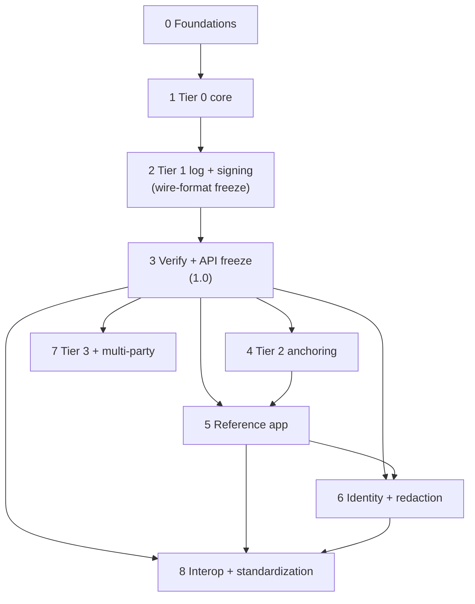

# thoughtmark — Roadmap Overview

> The index for the `thoughtmark` build: a freeze-gate-driven phase map (0–8) for a tamper-evident provenance/notarization library for multi-turn human–AI reasoning trails. **Source:** [roadmap.md](../research/roadmap.md) (TL;DR, Key Findings, §6, Recommendations, "Thresholds that change the plan", Caveats); [architecture.md](../research/architecture.md) §1, §2.1, §16, §17, §18, §19; [quality-foundations.md](../research/quality-foundations.md) §0 + bootstrap order + 27-row checklist.

---

## Project framing & the honesty frame

`thoughtmark` is a **layered library, not a blockchain product**. Roughly four-fifths of the system is mature, implementable primitives (content-addressed hashing, JCS canonicalization, Merkle transparency logs à la Rekor/Trillian, RFC 3161 + OpenTimestamps anchoring, in-toto/DSSE attestations, DID/VC identity); the genuine white-space — and the credibility artifact worth releasing — is a **signed, structured schema for multi-turn human–AI reasoning trails with per-turn attribution**, which no existing standard (C2PA, IPTC, CAWG, HDP, VAP) covers ([roadmap.md](../research/roadmap.md) TL;DR, Key Findings 1–2). The shape is a pure, audited Rust core (`thoughtmark-core` + `thoughtmark-schema`, `no_std`+`alloc`, `#![forbid(unsafe_code)]`) → byte-identical WASM/TS bindings (`@thoughtmark/core`) → a thin Next.js/Supabase MedQBank reference app, with side-effecting tiers attached as plugin crates that depend **inward only** ([architecture.md](../research/architecture.md) §1, §2.1, §3.3). Apache-2.0 (explicit patent grant + defensive termination, given Microsoft's authorship-attribution patents — [roadmap.md](../research/roadmap.md) Key Finding 5, Recommendation 6).

**The honesty frame is load-bearing and encoded in the type system, not the prose.** `thoughtmark` proves **integrity-of-record** — that a record *existed at time T, in a given lineage L, unaltered since capture*. It does **not** prove **validity-of-record** (that the content is true/correct) or **faithfulness** (that a logged chain-of-thought reflects the model's actual computation). The two hard problems are deliberately out of scope for v1: capture-integrity (the oracle problem) is mitigable but not solvable, and CoT faithfulness is open research (Anthropic 2025: Claude 3.7 Sonnet verbalized a decisive hint only 25% of the time; an exploited reward hack was verbalized in <2% of cases) ([roadmap.md](../research/roadmap.md) Key Findings 3–4, §4; [architecture.md](../research/architecture.md) §1.2, §19). This is invariant **I7** and threads through every phase (see [Honesty frame as a cross-cutting thread](#honesty-frame-as-a-cross-cutting-thread)).

This file is the INDEX. Per-phase detail lives in the nine phase files linked below; long specs live in the research docs and are cross-referenced, never restated.

---

## Phase map

Canonical phase index (0–8). "Depends on" points only to lower-numbered phases.

| Phase | Name | Objective (1 line) | Depends on | Exit / freeze gate |
|---|---|---|---|---|
| 0 | [Foundations & Quality Spine](phase-0-foundations.md) | Stand up the entire deterministic gate net against stubs; satisfy all 27 `[MUST]` controls. | — | `just ci` green vs stubs; all 27 `[MUST]` satisfied. |
| 1 | [Tier 0 — Canon/Hash/CID + determinism](phase-1-tier0-core.md) | Tier-0 byte foundation: JCS choke point, domain-separated BLAKE3/SHA-256 hashing, CIDv1, `tm-jcs-1`, determinism runtime. | [0](phase-0-foundations.md) | Tier-0 vectors green (still 0.x; nothing frozen). |
| 2 | [Tier 1 Log + Signing + Schema + WASM](phase-2-log-signing.md) | RFC 6962 Merkle log + checkpoints, DSSE/in-toto predicate + bundle, the reasoning-trail schema, byte-identical WASM. | [1](phase-1-tier0-core.md) | **WIRE-FORMAT FREEZE CANDIDATE.** |
| 3 | [Verify Pipeline + API Freeze → 1.0](phase-3-verify-apifreeze.md) | Offline `verify()` orchestrator + `VerificationResult`/`NotEstablished`; clean public surface; publish the 1.0 trio. | [2](phase-2-log-signing.md) | **API FREEZE / 1.0 trio published** (verbs + types + traits + format-identifier values immutable except by §16). |
| 4 | [Tier 2 — Anchoring + Monitor](phase-4-tier2-anchoring.md) | OpenTimestamps + RFC 3161 anchoring behind the injected `AnchorVerifier`; consistency monitor. | [3](phase-3-verify-apifreeze.md) | verify establishes `existed_at_or_before`; core stays 1.x (MINOR per new `AnchorKind`). |
| 5 | [Reference App (MedQBank)](phase-5-reference-app.md) | Next.js/Supabase demo: capture a study session, write ledger entries, anchor the daily root, render a two-band verifier. | [3](phase-3-verify-apifreeze.md), [4](phase-4-tier2-anchoring.md) | session captured→anchored→verified e2e; downloadable `.tmbundle`. |
| 6 | [Identity (DID/VC) + Redaction](phase-6-identity-redaction.md) | did:web/VC identity with digest pinning; salted-commitment redaction + crypto-shredding for GDPR/medical. | [3](phase-3-verify-apifreeze.md), [5](phase-5-reference-app.md) | redact/shred and the trail still verifies; did:web with document-digest pinning. |
| 7 | [Tier 3 (TEE/ZKML) + Multi-party](phase-7-tier3-multiparty.md) | Optional/pluggable TEE attestation (NRAS/Phala) + ZKML for small models; Fabric for multi-party distrust. | [3](phase-3-verify-apifreeze.md) | TEE attestation reference; `AttestationKind`/`AnchorKind` land as MINOR (optional). |
| 8 | [Interop (C2PA/CAWG) + Standardization](phase-8-interop-standardization.md) | One-way PROV-O/C2PA/CAWG export adapters; submit the reasoning-trail schema as an Internet-Draft. | [3](phase-3-verify-apifreeze.md), [5](phase-5-reference-app.md), [6](phase-6-identity-redaction.md) | Internet-Draft submitted; export never re-hashed (P6). |

---

## Dependency graph

A pure layered DAG; arrows always point to lower-numbered phases. Phase 3 (1.0 freeze) is the spine all later work hangs from.



ASCII fallback:

```text
0 ──► 1 ──► 2 ──► 3 ──┬──► 4 ──┐
                      │        ├──► 5 ──┐
                      ├────────┘        ├──► 6 ──┐
                      ├─────────────────┘        │
                      ├──► 7                      │
                      └──► 8 ◄────────────────────┘   (8 also ◄── 5)
```

Edges: `0→1→2→3`; `3→4`; `3,4→5`; `3,5→6`; `3→7`; `3,5,6→8`.

---

## The three freeze gates

These are honored across phase boundaries; once a gate closes, what it froze changes only by the §16 evolution rule.

1. **Wire-format freeze @ end of [Phase 2](phase-2-log-signing.md)** — the canonical bytes that flow into a hash/signature/proof (JCS rules `tm-jcs-1`, domain prefixes, `Digest`/`UnixMillis` wire forms, RFC 6962 leaf/node encoding, DSSE PAE, the `Provenance/v1` predicate, the bundle media-type). Phase 2's exit is the *freeze candidate*; the `spec/vectors/` corpus becomes the authoritative expected bytes ([architecture.md](../research/architecture.md) §17 Phase 1 row, §16).
2. **API / 1.0 freeze @ end of [Phase 3](phase-3-verify-apifreeze.md)** — the callable surface (§14 verbs, types, `#[non_exhaustive]` seam traits) becomes immutable except by §16. The 1.0 trio ships together: `thoughtmark-core 1.0.0` + `@thoughtmark/core 1.0.0` + `thoughtmark-vectors 1.0.0`, with the toolchain pinned in `manifest.json` ([architecture.md](../research/architecture.md) §17 Phase 2 row, §16).
3. **Format-identifier evolution rule (§16) thereafter** — changing any hashed byte is simultaneously **(a)** a new format-identifier *value*, **(b)** a MAJOR corpus release, and **(c)** usually only a MINOR code release. You **add `canon_v2`, never mutate `canon_v1`**; old artifacts stay verifiable forever because the verifier dispatches on the embedded `canon_version`; an **unknown version FAILS CLOSED** (`ErrorCode::UnknownCanonVersion`, a permanent negative vector — a best-effort recompute under guessed rules could forge a PASS). The breaking endgame is `tm-jcs-2` + `Provenance/v2` + `vectors 2.0.0` while 1.x verifiers keep working ([architecture.md](../research/architecture.md) §16, P5).

---

## Cross-cutting invariants (I1–I8)

These hold in **every** phase ([architecture.md](../research/architecture.md) §2.1). Each is a compile-gate or CI-gate, never a convention.

- **I1 — Byte-identical Rust / WASM / TS.** Identical logical input ⇒ byte-identical canonical bytes/digests/proofs/signatures/PAE on every platform; `spec/vectors/` is the oracle and one CI job asserts byte equality across native Rust + Node + headless browsers.
- **I2 — JCS-before-hash via one choke point.** No bare `H(json)`; every hash is over RFC 8785 bytes through `thoughtmark_core::canon::canonicalize` over **`serde_json_canonicalizer`**; **`serde_jcs` is banned** (ADR-0001), and a clippy `disallowed-methods` lint bans `serde_json::to_vec`/`to_string` on hashed data.
- **I3 — No ambient nondeterminism.** No `SystemTime::now`/`Instant::now`/`thread_rng`/`random` in core; time enters as `Clock::now() -> UnixMillis`, randomness via `Rng`/`Csprng` traits, keys via `Signer` — all injected; `verify()` takes no RNG.
- **I4 — No float on the canon/hash/CID/Merkle path.** WASM has NaN-bit and signed-zero nondeterminism; `f32`/`f64` are in `disallowed-types`, a `validate_no_float` walker rejects them, decimals are scaled integers (`*_milli: u32`), oversized integers are decimal strings (`bigint` in TS).
- **I5 — Salted hashes only; no content on any chain.** On-ledger types carry `ContentDigest::Hashed { digest_hex }` or a CID and structurally cannot hold a plaintext body; `AnchorRequest` carries only a 32-byte root; raw bodies live off-ledger, crypto-shreddable.
- **I6 — Audited crypto only.** Ed25519 via `ed25519-dalek` with **`verify_strict` always** (clippy bans bare `verify`); hashing via `blake3` + `sha2`; RFC 6962 math reimplemented in core but checked against external CT crates as differential oracles.
- **I7 — Integrity-not-validity-not-faithfulness.** Encoded in types (`NotEstablished`, `ApprovalScope`), field names (`attested_at`, `attributed_to`, `model_self_reported_version`), and verb naming — no `verify_trail()`/`verify_correct()`.
- **I8 — Pure, layered, dependency-light, audited core.** `thoughtmark-core` is `no_std`+`alloc`, `forbid(unsafe)`, no network/DB/clock/chain/RNG-source; a `cargo metadata` CI script fails the build if plugins leak into core's dep closure or core's dependents include a networking/plugin crate.

---

## Honesty frame as a cross-cutting thread

The integrity-not-validity-not-faithfulness frame (I7) is not a disclaimer — it is enforced at three concrete points as the build progresses:

1. **Schema field names @ [Phase 2](phase-2-log-signing.md)** — the hashed bytes themselves encode the limit: `attested_at` / `attributed_to` / `model_self_reported_version` (the model's *self-reported* identity, not third-party-attested), plus a first-class `ApprovalScope` so the *limit* of an endorsement lives inside the signed bytes ([architecture.md](../research/architecture.md) §5.1–§5.2, §1.1).
2. **`NotEstablished` in the verify result @ [Phase 3](phase-3-verify-apifreeze.md)** — `verify()` returns a `VerificationResult` carrying a permanent, machine-readable `NotEstablished { validity_of_record, faithfulness, authorship_truth, completeness, time_upper_bound_only }`; positive checks are reported as discrete machine-readable facts (`unaltered_since_capture`, `existed_at_or_before`) so a green verdict can never be silently read as a claim about content ([architecture.md](../research/architecture.md) §11, §19).
3. **Two-band verifier UI @ [Phase 5](phase-5-reference-app.md)** — the MedQBank verifier renders the established integrity facts and the `NotEstablished` non-claims in visibly separate bands, so the UI dogfoods the frame rather than overclaiming ([architecture.md](../research/architecture.md) §15; [roadmap.md](../research/roadmap.md) Recommendation 3).

---

## ADR → phase index

All 13 ADR seeds ([architecture.md](../research/architecture.md) §18), mapped to the phase where the decision first bites. ADRs become MADR files in `docs/adr/`.

| ADR | Decision (brief) | First bites @ |
|---|---|---|
| 0001 | JCS crate = `serde_json_canonicalizer`; `serde_jcs` banned (the day-one byte-format decision). | [P0](phase-0-foundations.md)–[P1](phase-1-tier0-core.md) |
| 0002 | One `thoughtmark-core` + separate `thoughtmark-schema`, not a `-canon`/`-crypto`/`-merkle` split (audit one trusted unit). | [P0](phase-0-foundations.md)–[P1](phase-1-tier0-core.md) |
| 0003 | `just` + pnpm scripts, no Turborepo in v1 (`just ci` already orders Cargo→wasm→TS). | [P0](phase-0-foundations.md)–[P1](phase-1-tier0-core.md) |
| 0004 | No umbrella meta-crate; explicit per-plugin deps (legible graph; no feature-unification leak into `no_std` core). | [P0](phase-0-foundations.md)–[P1](phase-1-tier0-core.md) |
| 0006 | `fuzz/` outside the workspace (`cargo-fuzz` pins nightly; would drag the workspace off the 1.96.0 stable pin). | [P0](phase-0-foundations.md)–[P1](phase-1-tier0-core.md) |
| 0005 | Reimplement RFC 6962 in core; external CT crates as differential oracles only (byte-identical in WASM + offline-deterministic). | [P2](phase-2-log-signing.md) |
| 0007 | Exactly one DSSE signature per sealed turn (mirrors the Sigstore bundle constraint; keeps the Merkle leaf canonical). | [P2](phase-2-log-signing.md) |
| 0010 | Vendor a ~60-LOC pure `did:key` decoder into core (it is on the byte-identity-critical path; did:web/VC stay in `-identity`). | [P2](phase-2-log-signing.md) |
| 0012 | Salt is external to the hashed leaf (a salt inside signed/logged bytes could never be deleted, defeating crypto-shredding). | [P1](phase-1-tier0-core.md) |
| 0013 | Transparency tree pinned to SHA-256 with a distinct `TreeHash` newtype (RFC 6962 / C2SP / witness interop). | [P2](phase-2-log-signing.md) |
| 0008 | `anchor` (submit) is async/shell; core exposes only the pure `verify_anchor` via an injected `AnchorVerifier` (DER/CMS/OTS parsers stay out of core). | [P3](phase-3-verify-apifreeze.md)–[P4](phase-4-tier2-anchoring.md) (frozen as the verb-split at P3, fully implemented at P4) |
| 0009 | OTS plugin implements the calendar HTTP protocol natively (`rust-opentimestamps` 0.7.2 only parses/replays). | [P4](phase-4-tier2-anchoring.md) |
| 0011 | Redaction = sign-over-the-salted-commitment; no exotic redactable-signature crypto in v1 (keeps `verify_strict` the only signature primitive). | [P6](phase-6-identity-redaction.md) |

---

## Traceability matrix

The research docs use two different phase numberings. This roadmap reconciles them and adopts **[architecture.md](../research/architecture.md) §17's freeze-gate-driven order**: where [roadmap.md](../research/roadmap.md) §6 differs (it folds signing into its Phase 0, and puts standardization at the very end with anchoring before the reference app), **§17 wins** — because the freeze gates (wire format, then 1.0) must define phase boundaries, and verification + 1.0 must close before any tier or app builds on the frozen surface. This roadmap also splits §17's broad later phases into finer units (anchoring, ref-app, identity/redaction, Tier 3, interop) for executability.

| This roadmap | [roadmap.md](../research/roadmap.md) §6 | [architecture.md](../research/architecture.md) §17 | [quality-foundations.md](../research/quality-foundations.md) bootstrap stage |
|---|---|---|---|
| 0 Foundations & Quality Spine | (pre-§6; the quality contract) | (pre-§17; the gate net) | Stages 1–4 (governance/determinism spine → language tooling → supply-chain → spec/docs) |
| 1 Tier 0 core | Phase 0 (Tier 0 portion) | Phase 0 — Tier 0 core | activates Stage-2 Rust gates as canon/hash/CID land |
| 2 Tier 1 log + signing + schema + WASM | Phase 0 (Tier 1 + DSSE + schema portion) | Phase 1 — Tier 1 log + signing | activates Stage-2 TS/WASM conformance + crypto vectors |
| 3 Verify + API freeze → 1.0 | Phase 1 (verify portion) | Phase 2 — API FREEZE → 1.0 | activates Stage-3 release provenance + `cargo-semver-checks` |
| 4 Tier 2 anchoring + monitor | Phase 1 (anchoring portion) | Phase 3 — Tier 2 anchoring | activates anchor-proof fuzz target |
| 5 Reference app (MedQBank) | Phase 2 — MedQBank reference app | Phase 3 (reference-app anchoring job) | activates Stage-2 Next.js lint/typecheck + app gates |
| 6 Identity + redaction | Phase 3 — Identity + redaction | Phase 5 (redaction maturation) | redaction/identity gates |
| 7 Tier 3 + multi-party | Phase 4 — Tier 3 + multi-party | Phase 4 — Tier 3 + multi-party | attestation plugin gates |
| 8 Interop + standardization | Phase 5 — Standardization | Phase 5 (C2PA/CAWG + Internet-Draft) | Stage-4 spec rigor (BCP 14 `SPEC.md`, Internet-Draft) |

The 4-stage [quality-foundations.md](../research/quality-foundations.md) bootstrap order is **entirely contained in Phase 0** (it stands the net up against stubs before the first implementation PR); later phases *activate* gates already stood up rather than introducing new bootstrap stages — see below.

---

## Thresholds that change the plan

Watch-items from [roadmap.md](../research/roadmap.md) ("Thresholds that change the plan") that would re-order or re-scope the roadmap:

- **ZKML reaches Llama-scale full-inference proofs at <1000× overhead** (DeepProve already lists Llama-class models in active development) → **promote [Phase 7](phase-7-tier3-multiparty.md)** from optional/pluggable to a headline Tier 3 feature.
- **C2PA ships a real conversation/turn assertion** (beyond the v2.3/v2.4 steganographic text blobs that have no turn semantics) → **pivot [Phase 8](phase-8-interop-standardization.md)** from "own the schema" to "extend C2PA."
- **A competing IETF draft (an HDP/VAP successor) adopts conversational reasoning-trail provenance** → **prioritize [Phase 8](phase-8-interop-standardization.md) standardization immediately** to avoid being preempted in the white-space.

(See also [roadmap.md](../research/roadmap.md) Caveats: ZKML figures are largely vendor-sourced; C2PA versioning moves fast; HDP/VAP/IPP are individual IETF drafts; the Microsoft patent claims are broad — get counsel.)

---

## Quality-gate activation rule

[Phase 0](phase-0-foundations.md) stands up the **entire** gate net at once — every one of the 27 `[MUST]` controls ([quality-foundations.md](../research/quality-foundations.md) bootstrap checklist), wired CI-authoritative with advisory hooks, running green against stub implementations that return "not implemented" before the first real code PR. Thereafter no phase re-introduces the whole net; each phase **activates** the gates as the code they target first appears: Tier-0 canon/CID fuzz targets and the no-float wall as canon lands @ [P1](phase-1-tier0-core.md); Wycheproof/RFC-6962 vectors, Miri, and the merkle/dsse/did_key fuzz targets @ [P2](phase-2-log-signing.md); `cargo-semver-checks` + release provenance @ [P3](phase-3-verify-apifreeze.md); the anchor-proofs fuzz target @ [P4](phase-4-tier2-anchoring.md); and so on. Each phase file states **which** gates it newly activates, never the whole net again. Hooks are advisory to a cooperative agent; **CI is the authoritative wall**, and a gate that exists in only one layer is treated as not-yet-real ([quality-foundations.md](../research/quality-foundations.md) §0).
